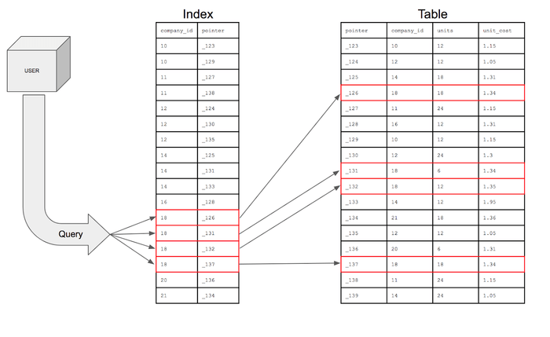
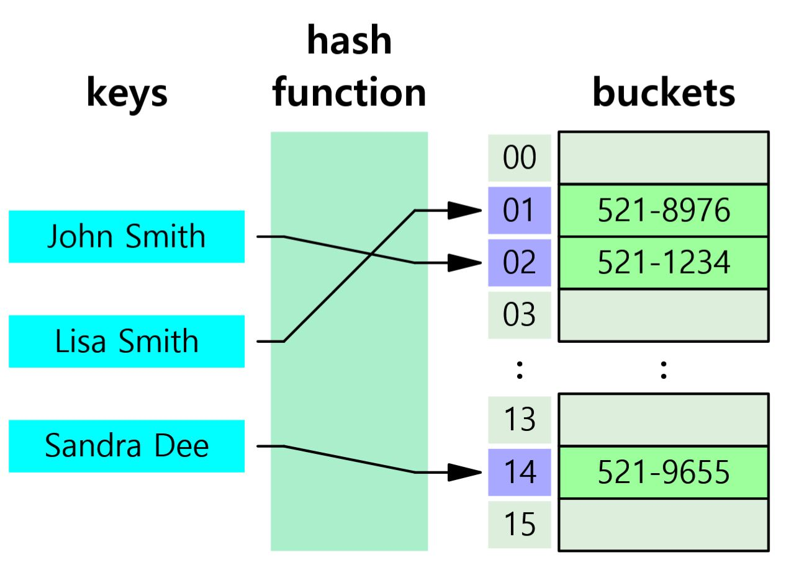
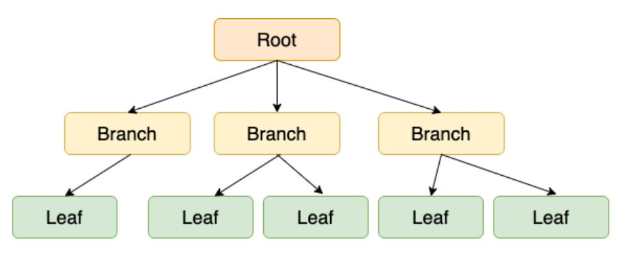
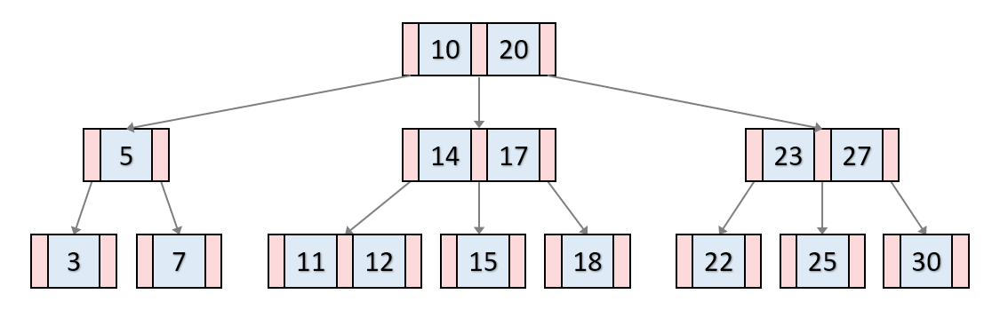
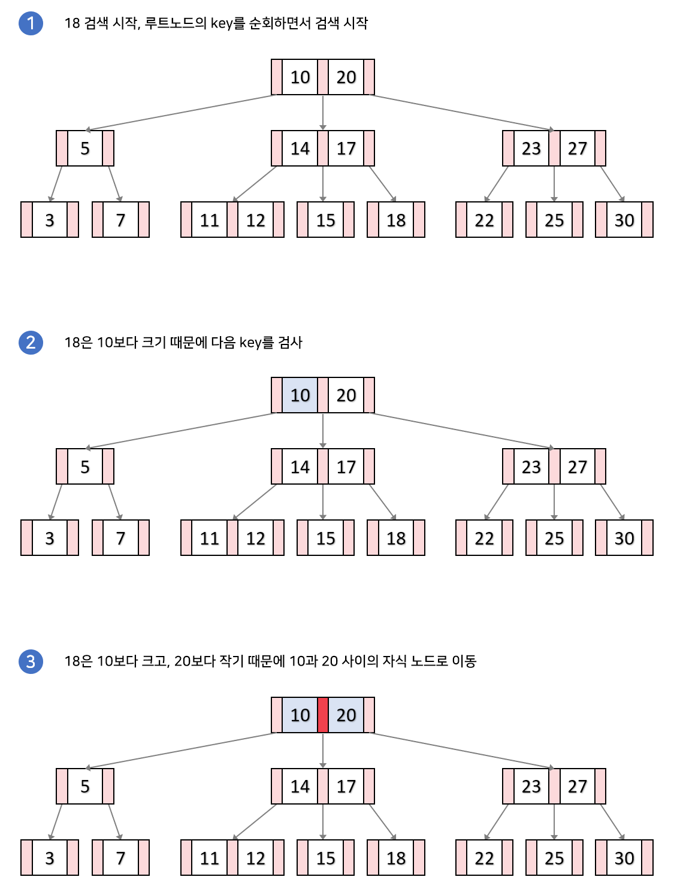
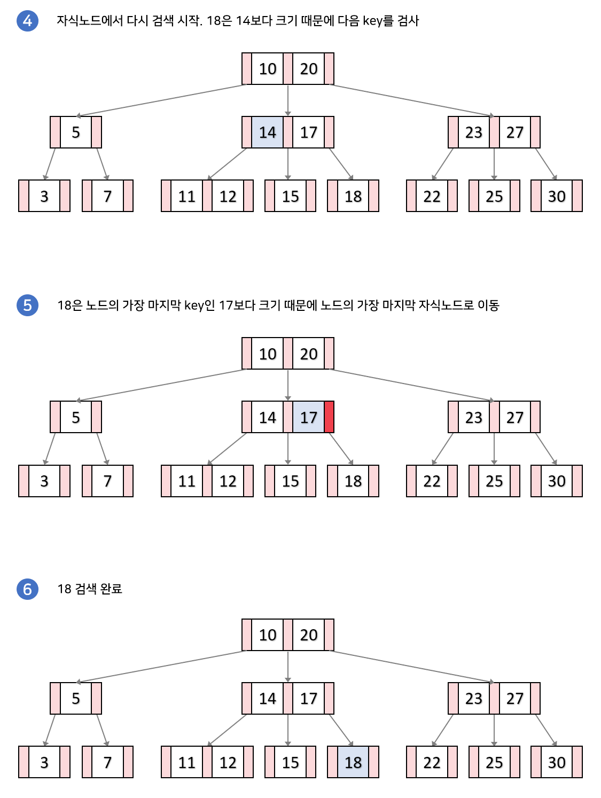
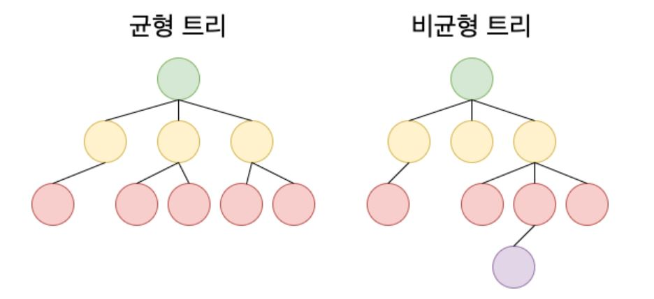
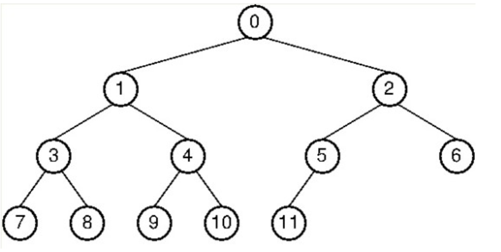
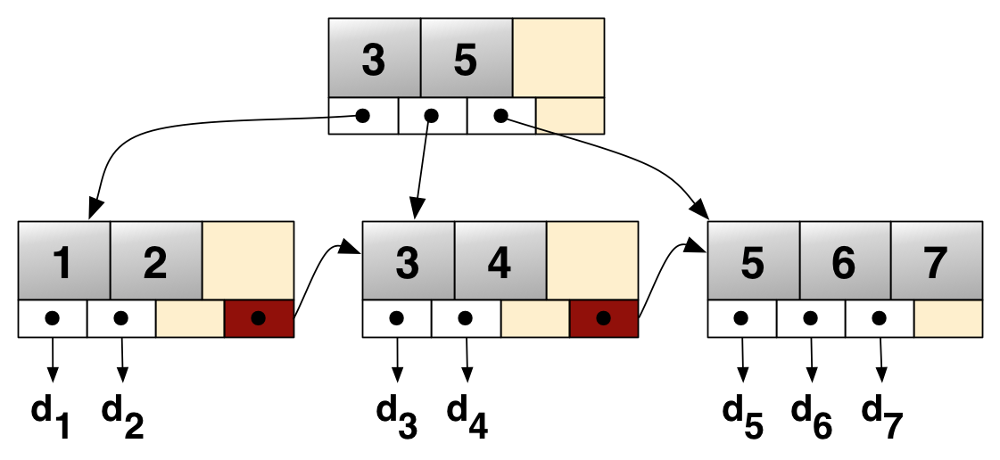
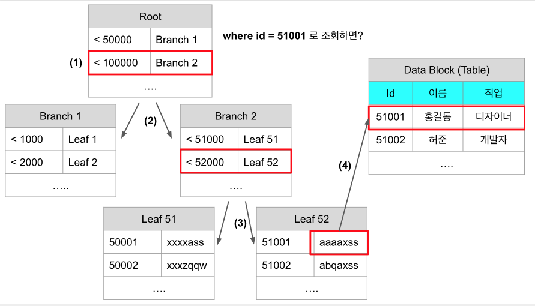

# 인덱스

## 인덱스란?

DB Index는 흔히 책의 목차에 비유된다. 만약 목차가 없다면, 독자가 해당 책에서 특정 내용을 찾으려 한다면 어떤 행동을 취하게 될까? 책의 첫 페이지부터 시작해서, 원하는 내용이 나올때까지 모든 페이지를 일일이 찾아 읽어야할 것이다. 반대로 목차가 존재한다면, 책의 분량이 많더라도 독자는 찾고자 하는 특정 내용이 몇 페이지에 있는지 바로 알 수 있다.

이처럼 인덱스는 검색에 소요되는 시간을 비약적으로 줄여주는 역할을 한다.

인덱스는 DB 분야에 있어서 테이블에 대한 동작 속도를 높여주는 자료 구조를 일컫는다.

인덱스는 테이블 내 1개의 컬럼, 혹은 여러 개의 컬럼을 이용하여 생성될 수 있다. 고속의 검색 동작뿐만 아니라 레코드 접근과 관련 효율적인 순서 매김 동작에 대한 기초를 제공한다.

```sql
SELECT * FROM USER WHERE COMPANY_ID = ?
```

DB의 특정 테이블에서 원하는 데이터들을 조회할 때, 조건절에 사용하는 컬럼의 Index가 없다면 어떻게 될까?

원하는 데이터의 위치를 특정할 수 없다보니 테이블 전체를 탐색하게 된다. (풀 스캔)



```sql
CREATE INDEX USER_COMPANY_INDEX ON USER(COMPANY_ID)
```

인덱스는 테이블이나 클러스트에서 쓰여지는 선택적인 객체로서, 오라클 데이터베이스 테이블내의 원하는 레코드를 빠르게 찾아갈 수 있도록 만들어진 데이터 구조이다.

- 자동 인덱스 : 프라이머리 키 또는 UINQUE 제한 규칙에 의해 자동적으로 생성되는 인덱스.
- 수동 인덱스 : CREATE INDEX 명령을 실행해서 만드는 인덱스

### **인덱스를 생성하는 것이 좋은 컬럼**

- ① WHERE절이나 join조건 안에서 자주 사용되는 컬럼
- ② null 값이 많이 포함되어 있는 컬럼
- ③ WHERE절이나 join조건에서 자주 사용되는 두 개이상의 컬럼들

### **다음과 같은 경우에는 인덱스 생성이 불필요 하다.**

- ① 테이블이 작을 때
- ② 테이블이 자주 갱신될 때

## 인덱스 자료 구조

DB 인덱스에 적합한 자료 구조로는 크게 해시 테이블, B-Tree, B+Tree 등이 있다.

### Hash Table



### 개요

해시 테이블은 Key-Value로 이루어진 데이터를 저장하는데 특화된 자료 구조이다.

해시 테이블 기반의 DB 인덱스는 특정 컬럼의 값과 데이터의 위치를 Key-Value로 사용한다.

즉, Key를 통한 데이터 접근이 가능하다.

### 동작

해시 테이블은 내부에 버켓이라고 하는 배열이 존재한다. 해시 함수를 통해 Key를 고유한 해시 값으로 변환하시키는데, 이를 버켓 배열의 인덱스로 사용하며 해당 인덱스에 Value를 저장한다.

Key → 해시함수 → 배열 인덱스

Key 값을 통해 Value가 저장되어 있는 주소를 바로 산출할 수 있기 때문에, 시간 복잡도는 O(1)이다.

하지만 해시 함수를 제대로 정의하지 않으면 해시 값이 중복되는 해시 충돌이 발생한다. 만약 너무 많은 해시 충돌이 발생하면 검색 성능이 하락해 시간 복잡도가 O(N)에 수렴할 수 있다.

### 용도

= 연산에는 적합하지만 부등호 연산(>, <)에는 부적합하다.

아래와 같은 경우에 전혀 사용할 수 없습니다.

- 가격이 10,000원 이하의 선물을 찾고 싶다.
- 제목이 "Final"로 시작하는 게임 리스트를 찾고 싶다.
- 최신순으로 정렬된 값을 찾고 싶다.

### B-Tree





### 개요

B-Tree란 자식 노드가 2개 이상인 트리를 의미한다. 이진검색 트리처럼 각 Key의 왼쪽 자식은 항상 Key보다 작은 값을 오른쪽 자식은 큰 값을 가진다.

B-Tree 기반의 DB 인덱스는 특정 컬럼의 값(Key)에 해당하는 노드에 데이터의 위치(Value)로 저장한다.

오라클 인덱스는 B-tree(binary search tree)에 대한 원리를 기반으로 하고 있다. B-tree 인덱스는 컬럼안에 독특한 데이터가 많을 때 가장 좋은 효과를 낸다.

### 동작

이 알고리즘 원리는

① 주어진 값을 리스트의 중간점에 있는 값과 비교한다.만약 그 값이 더 크면 리스트의 아래쪽 반을 버린다. 만약 그 값이 더 작다면 위쪽 반을 버린다.

② 하나의 값이 발견될 때 까지 또는 리스트가 끝날 때까지 그와 같은 작업을 다른 반쪽에도 반복한다.

마치 이분 탐색과 같다.

### 동작 예시





B-Tree의 Key-Value 값들은 항상 Key를 기준으로 오름차순 정렬이다. 이로 인해 부등호 연산(>, <)에 대해 해시 테이블보다 효율적인 데이터 탐색이 가능하다.

B-Tree는 균형 트리로서, 최상위 루트 노드에서 리프 노드까지의 거리가 모두 동일하기 때문에 평균 시간 복잡도는 O(logN)이다.



하지만 Index가 적용된 테이블에 데이터 갱신(INSERT, UPDATE, DELETE)이 반복되다보면, 트리의 균형이 깨지면서 성능이 악화된다.

또, 부등호를 이용한 검색 연산 성능이 좋지만, 순차 검색의 경우 중위 순회를 하는 탓에 효율이 좋지 않다.



예시의 경우, 7->3->8->1->9->4->10->0->11->5->2->6 순으로 조회하는 등 상당히 많은 노드를 확인해야한다.

이러한 이유로 인해 MySQL 엔진인 InnoDB는 B-Tree를 확장 및 개선한 B+Tree를 인덱스의 자료 구조로 사용한다.

### B+Tree



### 개요

B+Tree는 B-Tree를 확장 및 개선한 자료 구조로서, 말단의 리프 노드에만 데이터의 위치(Value)를 관리한다.

중간 브랜치 노드에 Value가 없어서 B-Tree보다 메모리를 덜 차지하는 만큼, 노드의 메모리에 더 많은 Key를 저장할 수 있다. 아울러 하나의 노드에 더 많은 Key를 저장하는 만큼 트리의 높이가 더 낮아진다.

1. Root Node : 가장 상위 노드 / 하위의 Branch Node 수만큼 Row를 가지고 있음
2. Branch Node : Root와 Leaf의 연결 고리 / 자기 하위의 LEaf Node 수만큼 Row를 가지고 있음
3. Leaf Node : Key + RowID로 구성 / Key 순서대로 정렬되어 있고, 이전 이후 Leaf의 Chain

또한 말단의 리프 노드들끼리는 LinkedList 구조로 서로를 참조하고 있다.

따라서 부등호(>, <)를 이용한 순차 검색 연산을 하는 경우, 많은 노드를 방문해야 하는 B-Tree에 비해 B+Tree는 말단 리프 노드를 저장한 LinkedList를 한 번만 탐색하는 등 속도 이점이 있다.

### 동작 예시



id가 인덱스(유니크)로 잡혀있는 상황에서 id가 51001인 데이터를 찾는다고 가정 하겠습니다.

1. 어느 Branch로 가야할지 Root에서 찾습니다.
2. Root에서 Branch2로 이동합니다.
3. Branch2에서 Leaf2로 이동합니다.
4. Leaf2에서 실제 데이터 위치(RowId : `aaaaxss`)로 이동

이렇게 총 4회만에 원하는 Row를 찾을 수 있습니다.

## 은 총알은 없다(No Silver Bullet)

Index를 사용하면 조회 성능이 우수해진다는 것을 알았다. 하지만 무턱대고 컬럼에 Index를 적용하는 것은 오히려 성능이 저하되는 역효과가 발생할 수 있다. 최악의 경우 인덱스의 메모리 공간이 테이블 메모리 공간만 해지는 경우도 있다. 따라서 인덱스 관리 비용이 증가하고 INSERT, UPDATE, DELETE의 성능 저하의 원인이 될 수 있다. 인덱스 사용 시 다음 내용을 고려하자.

### 고려 사항

- 인덱스 키의 크기는 되도록 작게 설계해야 성능에 유리하다.
- 분포도가 좋은 칼럼(좁은 범위), 기본 키, 조인의 연결 고리가 되는 칼럼을 인덱스로 구성한다.
- 단일 인덱스 여러 개보다 다중 칼럼 인덱스의 생성을 고려한다.
- 업데이트가 빈번하지 않은 칼럼으로 인덱스를 구성한다.
- JOIN 시 자주 사용하는 칼럼은 인덱스로 등록한다.
- 되도록 동등 비교(=)를 사용한다.
- WHERE 절에서 자주 사용하는 칼럼에는 인덱스 추가를 고려한다.
- 인덱스를 많이 생성하는 것은 INSERT/UPDATE/DELETE의 성능 저하의 원인이 될 수 있다.
- 인덱스 스캔이 테이블 순차 스캔보다 항상 빠르지는 않다. 보통 선택도(selectivity)가 5~10% 이내인 경우에 인덱스 스캔이 우수하다.

Index는 항상 최신 상태로 정렬되기 위해, 데이터 갱신(INSERT, UPDATE, DELETE) 작업에 대해 추가적인 연산이 발생한다.

1. INSERT : 새로운 데이터에 대한 인덱스가 추가된다.
2. DELETE : 삭제하는 데이터의 인덱스를 제거한다.
3. UPDATE : 기존의 인덱스를 제거하고, 갱신된 데이터에 대해 인덱스를 추가한다.

앞서 살펴본 Index 트리 자료 구조는 값이 추가 혹은 삭제될 때마다, 트리 균형을 위해 트리 구조의 재분배 및 합병 등 복잡한 연산이 수반된다. 따라서 데이터 갱신보다는 조회에 주로 사용되는 컬럼에 Index를 생성하는 것이 유리하다.

정리하면, 데이터베이스 튜닝의 핵심은 적절한 수의 인덱스를 생성하고 질의가 이 인덱스를 활용할 수 있도록 질의를 최적화하는 것이다. 이를 위해서는 DBMS에 구현된 인덱스 구조와 다양한 활용 기법을 이해하고, 질의 패턴과 사용 빈도, I/O 비용, 저장 공간에 대한 비용을 전체적으로 고려해야 한다.

## **Index 대상 컬럼 선정하기**

일반적으로 Cardinality가 높은 컬럼을 우선적으로 인덱싱하는 것이 검색 성능에 유리하다. Cardinality란 특정 데이터 집합의 유니크(Unique)한 값의 개수를 의미한다.

- 남-여 등 2가지 값만 존재하는 성별 컬럼은 **중복도가 높으며 카디널리티가 낮습니다.**
- 개인마다 고유한 값이 존재하는 주민번호 컬럼은 **중복도가 낮으며 카디널리티가 높습니다.**

Cardinality 높은 컬럼의 경우, Index를 통해 데이터를 더 많이 필터링할 수 있기 때문이다.
