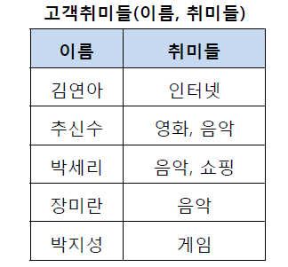
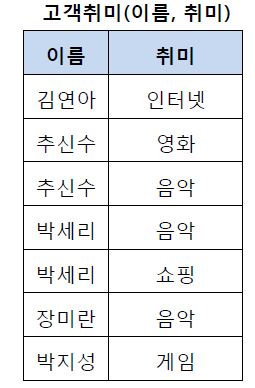
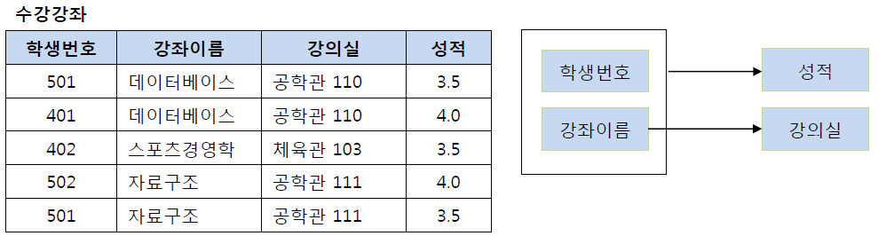
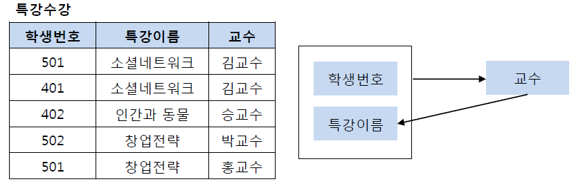
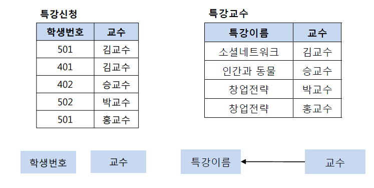

# 정규화

## 들어가기전

### 용어 정리

- 릴레이션 : 관계형 데이터베이스에서 정보를 구분하여 저장하는 기본 단위, 즉 DB 테이블이다.
- 데이터 무결성 : 데이터의 정확성, 일관성이 유지되는 것을 의미.
  - 정확성 : 중복이나 누락이 없는 상태
  - 일관성 : 원인과 결과의 이미가 연속적으로 보장되어 변하지 않는 상태

## 정규화란 무엇인가?

### 정의

관계형 데이터베이스에서 **중복을 최소화**하기 위해 데이터를 구조화하는 작업이다.

구체적으로는 불만족스러운 나쁜 릴레이션의 속성들을 나누어 좋은 릴레이션으로 분해하는 작업을 말한다.

이를 통해 데이터 무결성을 유지할 수 있으며, DB의 저장 용량 역시 줄일 수 있다.

테이블을 분해하는 정규화 단계가 정의되어 있는데, 여기서 테이블을 어떻게 분해되는지에 따라 정규화 단계가 달라지며, 정규화를 거치게되면 정규형을 만족하게 된다. 정규형이란 특정 조건을 만족하는 릴레이션의 스키마의 형태를 말하며 제 1 정규형, 제 2 정규형, 제 3 정규형 등이 존재한다.

### 탄생 배경

한 릴레이션에 여러 엔티티의 속성들을 혼합하게 되면 정보가 중복 저장되며, 저장 공간을 낭비하게 된다. 또 중복된 정보로 인해 `갱신 이상`이 발생하게 된다. 동일한 정보를 한 릴레이션에는 변경하고, 나머지 릴레이션에서는 변경하지 않은 경우 어느 것이 정확하지 알 수 없게 되는 것이다. 이러한 문제를 해결하기 위해 정규화 과정을 거치는 것이다.

## 정규화 단계

### 제 1 정규화

테이블의 컬럼이 원자값(하나의 값)을 갖도록 테이블을 분해하는 것이다.

제 1 정규형은 다음과 같은 규칙들을 만족해야 한다.

- 각 컬럼이 하나의 속성만을 가져야 한다.
- 하나의 컬럼은 같은 종류나 타입의 값을 가져야 한다.
- 각 컬럼이 유일한 이름을 가져야 한다.
- 컬럼의 순서가 상관없어야 한다.

위의 테이블에서 추신수와 박세리는 여러 개의 취미를 가지고 있기 때문에 제 1 정규형을 만족하지 못하고 있다. 그렇기 때문에 이를 제1 정규화하여 분해할 수 있다. 제1 정규화를 진행한 테이블은 아래와 같다.

### 제 2 정규화

제 1 정규화를 진행한 테이블에 대해 완전 함수 종속을 만족하도록 테이블을 분해하는 것이다.

- 완전 함수 종속 : `X → Y` 라고 가정했을 때, X의 어떠한 애트리뷰트라도 제거하면 더 이상 함수 종속성이 성립하지 않은 경우를 말한다. 즉, `key`가 아닌 열들이 각각 후보키에 대해 결정되는 릴레이션 형태를 말한다.

제 2 정규형은 다음과 같은 규칙을 만족해야 한다.

- 1 정규형을 만족해야 한다.
- 모든 컬럼이 완전 함수 종속을 만족해야 한다.

이 테이블에서 기본키는 (학생번호, 강좌이름)으로 복합키이다. 또 이는 기본키로 성적을 결정하고 있다.

- (학생 번호, 강좌이름) → 성적

그런데 강의실이라는 컬럼은 기본키의 부분집합인 강좌이름에 의해 결정될 수 있다.

- (강좌이름) → 강의실

종합하자면, (학생번호, 강좌이름) → 성적에서 학생번호 속성을 제거하더라도 (강좌이름) → 강의실이 성립하므로 완전 함수 종속을 만족하지 않아 제 2 정규형을 만족시킬 수 없다. 때문에 기존의 테이블에서 강의실을 분해하여 별도의 테이블로 관리하여야 제 2정규형을 만족시킬 수 있다.

### 제 3 정규화

제 2 정규화를 진행한 테이블에 대해 이행적 종속을 없애도록 테이블을 분해하는 것이다.

- 이행 함수적 종속 : `X → Y`, `Y → Z` 의 경우에 의해 추론될 수 있는 `X → Z`의 종속 관계를 말한다.

제 정규형은 다음과 같은 규칙을 만족해야 한다.

- 제 2 정규형을 만족해야 한다.
- 기본키를 제외한 속성들 간의 이행 종속성이 없어야 한다.

| ID  | 등급 | 할인율 |
| --- | ---- | ------ |
| 101 | VIP  | 40%    |
| 102 | GOLD | 20%    |
| 103 | GOLD | 20%    |

위의 테이블을 살펴보면, ID를 통해 등급을 알 수 있고 등급을 통해 할인율을 알 수 있다.

즉, ID를 알면 할인율을 알 수 있다. 따라서 이행 종속성이 존재하므로 제 3 정규형을 만족하지 않는다.

따라서 이를 각각 분해하여 제 3정규형을 만족할 수 있다.

| ID  | 등급 |
| --- | ---- |
| 101 | VIP  |
| 102 | GOLD |
| 103 | GOLD |

| 등급 | 할인율 |
| ---- | ------ |
| VIP  | 40%    |
| GOLD | 20%    |
| GOLD | 20%    |

### BCNF 정규화

제 3 정규화를 진행한 테이블에 대해 모든 결정자가 후보키가 되도록 테이블을 분해하는 것이다. 복잡한 식별자 관계에 의해 발생하는 문제를 해결하기 위해 제 3정규형을 보완한 정규형이다.

BNCF 정규형은 다음과 같은 규칙을 만족해야 한다.

- 제 3정규형을 만족해야 한다.
- 모든 결정자가 후보키 집합에 속해야 한다.

위의 테이블에서 기본키는 (학생번호, 특강이름)이다. 이를 통해 교수를 결정하고 있다. 또한 교수는 특강이름을 결정하고 있다.

문제는 교수가 특강이름을 결정하는 결정자임에도 불구하고 후보키가 아니라는 점이다. 그렇기 때문에 BNCF 정규화를 만족시키기 위해서는 기존 테이블을 특강신청 테이블과 특강교수 테이블로 분해해야 한다.

## 정규화의 장단점

### 장점

- 데이터베이스 변경 시 이상 현상 제거
  - 삽입 이상(insertion anomalies) : 원하지 않는 자료가 삽입된다든지, 삽입하는데 자료가 부족해 삽입이 되지 않아 발생하는 문제점을 말한다.
  - 삭제 이상(deletion anomalies) : 하나의 자료만 삭제하고 싶지만, 그 자료가 포함된 튜플 전체가 삭제됨으로 원하지 않는 정보 손실이 발생하는 문제점을 말한다.
  - 수정(갱신)이상(modification anomalies) : 정확하지 않거나 일부의 튜플만 갱신되어 정보가 모호해지거나 일관성이 없어져 정확한 정보 파악이 되지 않는 문제점을 말한다.
- 데이터베이스 구조 확장 시 재 디자인 최소화
  - 정규화된 데이터베이스 구조에서는 새로운 데이터 형의 추가로 인한 확장 시, 그 구조를 변경하지 않아도 되거나 일부만 변경해도 된다. 이는 데이터베이스와 연동된 응용 프로그램에 최소한의 영향만을 미치게 되며 응용프로그램의 생명을 연장시킨다.
- 사용자에게 데이터 모델을 더욱 의미있게 제공
  - 정규화된 테이블들과 관계들은 현실 세계에서의 개념들과 그들간의 관계들을 반영한다.

### 단점

- 릴레이션의 분해로 인해 릴레이션 간의 연산(JOIN 연산)이 많아진다.
  - 이로 인해 질의에 대한 응답 시간이 느려질 수 있다. 특히 데이터 조회에서 많이 발생한다.
  - 조인으로 인하여 성능이 저하되는 문제를 반정규화로 해결할 수 있다.

### 반정규화

정규화된 엔티티, 속성, 관계를 시스템의 성능 향상 및 개발과 운영의 단순화를 위해 중복 통합, 분리 등을 수행하는 데이터 모델링 기법 중 하나이다. 디스크 I/O 량이 많아서 조회 시 성능이 저하되거나, 테이블끼리의 경로가 너무 멀어 조인으로 인한 성능 저하가 예상되거나, 컬럼을 계산하여 조회할 때 성능이 저하될 것이 예상되는 경우 반정규화를 수행하게 된다. 일반적으로 조회에 대한 처리 성능이 중요하다고 판단될 때 부분적인 반정규화를 고려하게 된다. 다만, 과도한 적용은 데이터 무결성을 깨뜨릴 위험이 있으므로 주의해야 한다.

### 반정규화의 대상

- 자주 사용되는 테이블에 액세스하는 프로세스 수가 많고, 항상 일정한 범위만을 조회하는 경우
- 테이블에 대량 데이터가 있고 대량의 범위를 자주 처리하는 경우
- 테이블에 지나치게 조인을 많이 사용하게 되어 데이터를 조회하는 것이 기술적으로 어려울 경우

### 출처

[망나니 개발자 - [Database] 정규화(Normalization) 쉽게 이해하기](https://mangkyu.tistory.com/110)
