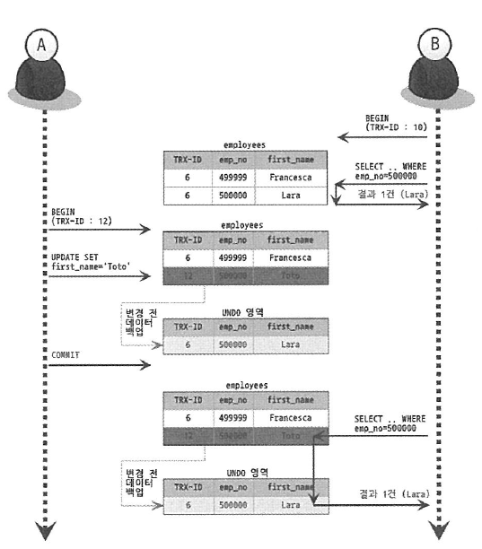
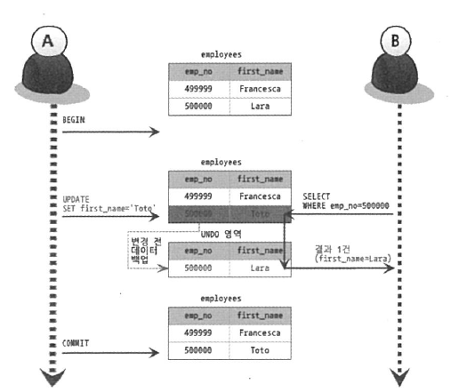
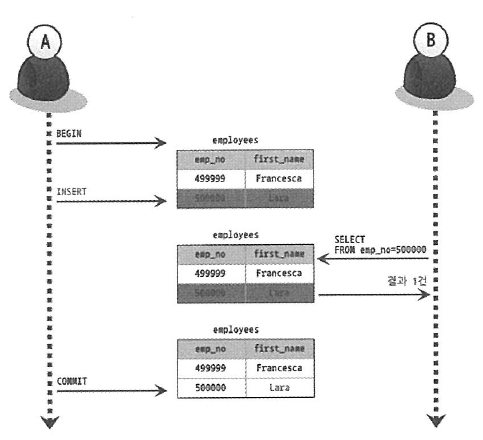

# 트랜잭션 격리 수준

여러개의 트랜잭션이 한번에 처리될 때, 특정 트랜잭션이 변경하거나 조회하고 있는 데이터에 대해서 다른 트랜잭션의 **조회 허용 여부**를 결정하는 것이다. 트랜잭션 격리 수준은 다음과 같이 4개로 구분된다.

- SERIALIZABLE(직렬화 가능)
- REPETABLE READ(반복 가능한 읽기) - MySQL
- READ COMMITTED(커밋된 읽기) - 오라클
- READ UNCOMMITTED(커밋되지 않은 읽기)

밑으로 갈수록 격리 수준이 낮아지며, 동시 처리 성능이 높아진다. 반대로 위로 올라 갈수록 격리 수준이 높아지며, 동시 처리 성능은 낮아지지만 데이터 부정합 문제가 발생할 확률이 줄어든다.

정리하자면, 데이터 정합성과 성능은 반비례한다.

## 트랜잭션 격리 수준에 따른 발생 가능한 문제점

### 더티 리드(Dirty Read)

더티 리드는 특정 트랜잭션에 대해 데이터가 변경되었지만, 아직 커밋되지 않은 상황에서 다른 트랜잭션이 해당 변경 사항을 조회할 수 있는 문제를 말한다.

### 반복 불가능한 조회(Non-Repeatable Read)

하나의 트랜잭션 내에서 같은 데이터를 여러번 조회했을 때 읽어온 데이터가 다른 경우를 의미한다.

- `트랜잭션B`에서 1번 상품의 총 투자액을 조회 → 100만원이 조회됨
- `트랜잭션A`에서 1번 상품의 총 투자액을 120만원으로 변경(COMMIT)
- `트랜잭션B`에서 1번 상품의 총 투자액을 다시 조회 → 120만원이 조회됨 (`NON-REPEATABLE READ` )

### 팬텀 리드(Phantom Read)

위의 반복 불가능한 조회의 한 종류로 조회해온 결과의 행이 새로 생기거나 없어지는 현상이다.

아래 표는 트랜잭션 격리 수준에 따라 발생하는 문제점이다.

| 격리 수준        | DIRTY READ | NON-REPEATABLE READ | PHANTOM READ          |
| ---------------- | ---------- | ------------------- | --------------------- |
| READ UNCOMMITTED | 발생       | 발생                | 발생                  |
| READ COMMITTED   | 없음       | 발생                | 발생                  |
| REPEATABLE READ  | 없음       | 없음                | 발생(InnoDB는 발생 X) |
| SERIALIZABLE     | 없음       | 없음                | 없음                  |

## 트랜잭션 격리 수준 살펴보기

### SERIALIZABLE(직렬화 가능)

특정 트랜잭션이 사용중인 테이블의 모든 행을 다른 트랜잭션이 접근할 수 없도록 잠근다. 가장 단순한 격리 수준이면서 동시에 가장 엄격한 격리 수준이다.

단순한 읽기 작업(SELECT)도 읽기 잠금을 획득해야 하기에 다른 트랜잭션에서 절대 접근할 수 없다.

- 가장 높은 데이터 정합성(반대로, 성능은 가장 떨어진다.)

### REPETABLE READ(반복 가능한 읽기)

이름에서 유추할 수 있듯이, 특정 행을 조회할 때 항상 같은 데이터 응답을 보장하는 격리 수준이다.

하지만, SERIALIZABLE과 달리 행의 추가는 막지 않는다. 이로 인해 팬텀 리드 현상이 발생할 수 있다.

### READ COMMITTED(커밋된 읽기) - 오라클

커밋이 완료된 트랜잭션의 변경사항만 다른 트랜잭션에서 조회할 수 있도록 허용하는 격리 수준이다. 즉, 특정 트랜잭션이 이루어지는 동안 트랜잭션은 해당 데이터에 접근할 수 없다.

특정 트랜잭션에서 데이터가 변경되었으나, 아직 커밋되지 않은 상태라면 다른 트랜잭션에서는 해당 데이터에 접근했을 때 트랜잭션 **시작 전 데이터**를 읽어온다.

### READ UNCOMMITTED(커밋되지 않은 읽기)

커밋이 되지 않은 트랜잭션의 데이터 변경 내용을 다른 트랜잭션이 조회하는 것을 허용하는 격리 수준이다. 데이터 부정합 문제가 발생할 확률이 높지만, 성능은 가장 빠르다.

