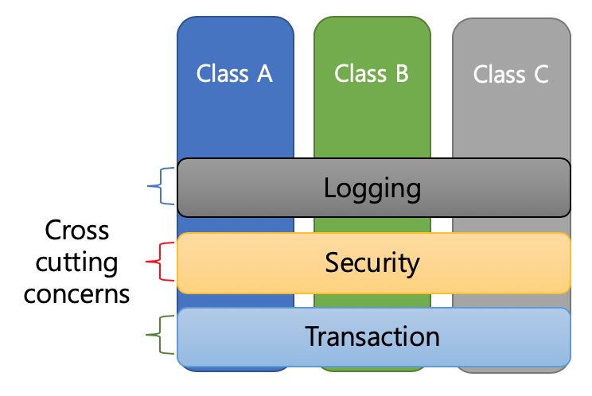
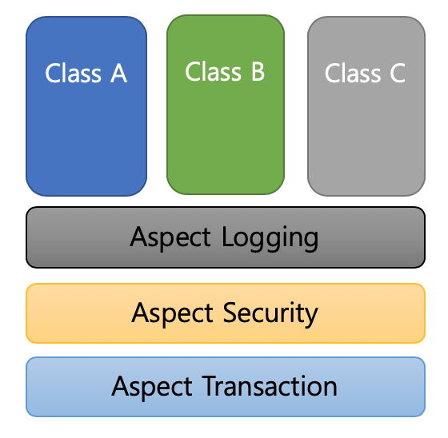
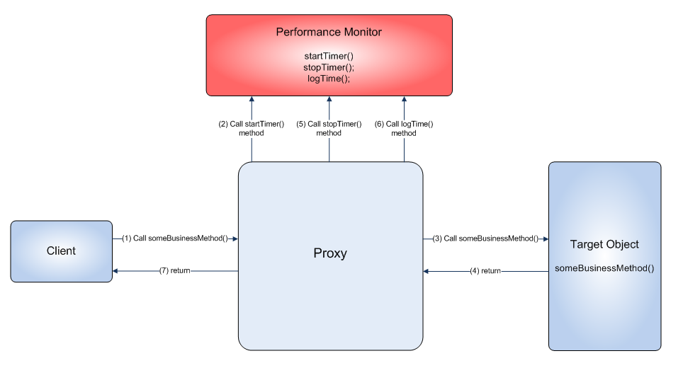

## AOP(Aspect-Oriented Programming)

관점 지향 프로그래밍이란 OOP로 독립적으로 분리하기 어려운 부가 기능을 모듈화하는 방식이다.

### OOP의 한계

객체지향 프로그래밍은 어플리케이션을 설계할 때 책임과 관심사에 따라 클래스를 분리한다.

- 클래스가 단일 책임을 가지도록 분리하여 각 모듈의 응집도를 높이는 동시에 결합도를 낮춘다.
- 그 결과, 클래스를 변경하는 이유는 오직 한가지이며, 어플리케이션의 한 부분에서 변경이 발생했을 때 파급효과가 시스템의 전체로 퍼져나가는 정도가 낮아지는 이점이 있다.

그러나 전통적인 객체지향 설계 방식을 충실히 따르더라도 한 가지 아쉬운 점이 존재한다.



위 그림처럼, 여러 클래스에 걸쳐 로깅, 보안, 트랜잭션 등 공통된 기능들이 흩어져 존재한다는 점이다.

이처럼 어플리케이션 전반에 흩어져있는 공통되는 부가 기능들을 **관심사**라고 한다. 이러한 공통된 관심사들이 모여 부가 기능 모듈이라고 하며, 이를 **Aspect**라고 한다. 다시 말해, 핵심 비즈니스 로직을 담고 있지는 않지만 어플리케이션에 부가됨으로써 의미를 갖는 특별한 모듈을 뜻한다.

결국, AOP는 핵심 비즈니스 로직과 부가 기능 Aspect를 분리하는 등 OOP를 보완하는 역할을 수행하.것 .적 읻적이다. 흩어진 관심사에 AOP를 적용하게 되면, 다음과 같이 나타낼 수 있다.



## AOP의 주요 개념

- **Aspect** : 흩어진 관심사를 모듈화한 것.
- **Advice** : 실질적으로 어떤 일을 해야할 지에 대한 정의. (실질적 부가기능을 담은 구현체)
- **Target** : Aspect가 가지고 있는 Advice를 적용할 대상(클래스, 메서드 등..)
- **JoinPoint** : Advice가 적용될 위치, 시점(메서드 실행 시점, 생성자 호출 직전, 필드에서 값을 꺼내올 때 등 구체적이고 다양한 시점에 적용 가능)
- **PointCut** : JoinPoint의 상세 스펙을 정의한 것. (’A’란 메서드의 진입 시점에 호출할 것’과 같이 구체적으로 Advice가 실행될 지점을 정함)

## AOP 적용 방법

1. 컴파일 시점 - 컴파일 시 Aspect가 포함된 바이트 코드로 컴파일
2. 로드 타임 - 바이트 코드에는 Aspect가 포함되어 있지 않고, 클래스 파일을 로드하는 시점에 Weaving하여 로드
3. 런타임 시점 - 해당 타입의 클래스를 Bean으로 만드는 과정에서 해당 타입의 Proxy Bean을 생성한다.

### Proxy 패턴

**EventService.java**

```java
public interface EventService {
   void createEvent();
   void publishEvent();
   void deleteEvent();
}
```

**EventServiceImpl.java**

```java
public class EventServiceImpl implements EventService{
    @Override
    public void createEvent() {
        System.out.println("Created an event");
    }
    @Override
    public void publishEvent() {
        System.out.println("Published an event");
    }

    @Override
    public void deleteEvent() {
        System.out.println("Deleted an event");
    }
}
```

**EventServiceProxy.java**

```java
public class EventServiceProxy implements EventService{

    private final EventServiceImpl baseSimpleEventService = new EventServiceImpl();

    @Override
    public void createEvent() {
        long beginTime = System.currentTimeMillis();
        try {
            Thread.sleep(1000);
        } catch (InterruptedException e) {
            e.printStackTrace();
        }
        baseSimpleEventService.createEvent();
        System.out.println(System.currentTimeMillis() - beginTime);
    }

    @Override
    public void publishEvent() {
        long beginTime = System.currentTimeMillis();
        try {
            Thread.sleep(2000);
        } catch (InterruptedException e) {
            e.printStackTrace();
        }
        baseSimpleEventService.publishEvent();
        System.out.println(System.currentTimeMillis() - beginTime);
    }

    @Override
    public void deleteEvent() {
        baseSimpleEventService.deleteEvent();
    }
}
```

프록시는 클라이언트가 사용하려고 하는 실제 타깃처럼 위장해서 요청을 받는다.

`EventService` 인터페이스를 구현하는 두 가지 구현체 `EventServiceProxy` 클래스, `EventServiceImpl` 클래스를 만듭니다. `EventServiceProxy` 클래스의 `EventService` 타입 필드는 실제 핵심 비즈니스 로직을 구현한 `EventServiceImpl` 인스턴스를 주입한다.

정리하자면, 프록시 객체에 로깅, 트랜잭션 등 부가 기능 관련 로직을 위치시키고, 클라이언트 요청이 발생하면 실제 타깃 객체는 프록시로부터 요청을 위임받아 핵심 비즈니스 로직을 실행한다. 이를 **데코레이터 패턴**이라고 한다.

이와 같은 방법으로도 분리할 수 있지만, 여전히 한계가 분명하다.

- 여전히 매번 Proxy 클래스를 작성해야 한다. 결국, 코드의 반복이 계속된다.
- 여러 클래스, 여러 메서드에 적용하기 위해선 모든 클래스에 Proxy 클래스를 만들어 코드를 심어야한다.
- 객체들 관계가 복잡해진다.

## 그래서 등장한 것이 스프링 AOP

## 스프링 AOP 특징

- 스프링 IoC Container가 제공하는 기반 시설과 Dynamic Proxy를 사용하여 여러 복잡한 문제 해결하였다.
  - Dynamic Proxy: 동적으로 Proxy 객체 생성하는 방법
    - 자바가 제공하는 방법은 인터페이스 기반 Proxy 생성.
    - CGlib은 클래스 기반 Proxy도 지원.
  - 스프링 IoC: 기존 Bean을 대체하는 동적 Proxy Bean을 만들어 등록 시켜준다.
    - 클라이언트 코드 변경이 없다.
    - Bean Instance를 만든 이후 그 Bean을 감싼 AOP Proxy Bean을 만들어 주는 역할을 수행한다.
- Spring Bean에만 AOP를 적용할 수 있다.
- 모든 AOP 기능을 제공하는 것이 목적이 아니라 스프링 IoC와 연동하여 엔터프라이즈 애플리케이션에서 가장 흔한 문제에 대한 해결책을 제공하는 것이 목적이다.



### 구현 틀

```java
@Aspect
public class 클래스명{

    @어드바이스(AspectJ표현식)
    public Object 메서드명(ProceedingJoinPoint joinPoint) throws Throwable{

        //부가기능 로직 작성
        //부가기능 로직 작성
        //부가기능 로직 작성

        Object result = joinPoint.proceed();  //실제 타깃 요청 위임 메서드

        //부가기능 로직 작성
        //부가기능 로직 작성
        //부가기능 로직 작성

        return result;
    }
}
```

### 1. execution expression

```java
@Component
@Aspect
public class PerformanceAspect {

    @Around("execution(* com.example..*.EventService.*(..))")
    public Object logPerformance(ProceedingJoinPoint pip) throws Throwable {
        long beginTime = System.currentTimeMillis();
        Object letVal = pip.proceed();
        System.out.println(System.currentTimeMillis() - beginTime);
        return letVal;
    }
}
```

### 2. annotation 기반

위와 같은 execution expression 방식은 한가지 문제가 있다.

하나의 클래스의 여러 메서드 중 일부에만 적용하는 것이 불가능한다는 점이다.

이럴 때 어노테이션 기반 Advice 정의를 통해 해결할 수 있다.

먼저, 다음과 같이 어노테이션을 만든다.

```java
public @interface Loggable {
}
```

Aspect 클래스의 @Around를 다음과 같이 수정한다.

```java
@Around("@annotation(Loggable)")
public Object logPerf(ProceedingJoinPoint pjp) throws Throwable {
    long begin = System.currentTimeMillis();
    Object retVal = pjp.proceed();
    System.out.println(System.currentTimeMillis() - begin);
    return retVal;
}
```

이제, 적용될 클래스의 메서드에 위에서 정의한 @Loggable을 붙여주면 된다.

```java
@Loggable
@Override
public void createEvent() {
    ...
}

@Loggable
@Override
public void publishEvent() {
    ...
}

@Override
public void deleteEvent() {
		...
}
```

### 3. 특정 bean 기반

bean(여기서는 simpleServiceEvent)이 가지고 있는 모든 public 메서드에다가 적용하는 방법도 있다.

```java
@Around("bean(simpleServiceEvent)")
public Object logPerf(ProceedingJoinPoint pjp) throws Throwable {
  long begin = System.currentTimeMillis();
  Object retVal = pjp.proceed();
  System.out.println(System.currentTimeMillis() - begin);
  return retVal;
}
```
