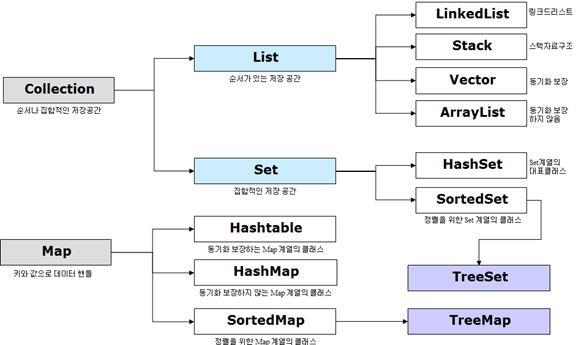

# 자바 기초

## 자바란 무엇인가?

### 자바의 역사

자바는 제임스 고슬링과 다른 연구원들이 개발한 객체 지향적 프로그래밍 언어로 1995년에 발표되었다.

처음에는 가전제품 내에 탑재해 동작하는 프로그램을 위해 개발했지만 현재는 웹 애플리케이션과 모바일 앱 개발에 가장 많이 사용하는 언어로 성장했다.

### 자바의 특징

자바를 개발한 선 마이크로 시스템즈는 자바를 다음과 같이 정의 했다.

> Java: A simple, object-oriented, distributed, interpreted, robust, secure, architecture neutral, portable, high-performance, multithreaded, and dynamic language

그 중 몇가지만 살펴보자.

**1. 객체 지향적이다.**

자바는 숫자(int, folat, long 등)나 논리값(true, false)를 제외한 거의 모든 것이 객체로 구성되어 있다.

실제로 자바는 Object 클래스에서 모든 클래스를 파생한다.

자바는 이러한 이유로 int, float, long, true, false 등을 원시 자료형이라고 한다.

**2. 인터프리터 언어이다.**

자바는 정확하게 말하면 컴파일 언어인 동시에 인터프리터 언어이다.

자바는 먼저 텍스트 소스를 컴파일하여 2진 클래스 파일로 만든 다음 자바 런타임이 클래스 파일을 인터프리터하면서 실행한다. 먼저 시스템에 무관한 2진 파일을 만듦으로써 자바는 컴파일 언어에 가까운 속도와 시스템 독립성을 동시에 얻을 수 있었다.

**3. 플랫폼 독립적이다.**

자바의 실행 파일은 이진 코드 파일이다. 따라서 자바 런타임이 설치된 시스템에서는 어디서나 자바 프로그램을 실행할 수 있다.

자바는 한번 작성한 프로그램은 OS에 상관없이 어디서든 돌려볼 수 있다. 이것은 자바 프로그램이 가상머신에 의해서 실행되기 때문이다.

**4. 멀티 쓰레딩을 지원한다.**

멀티쓰레드를 지원할 경우 하나의 프로그램 단위가 동일한 쓰레드를 동시에 수행할 수 있다.

특히 자바는 멀티 프로세서 하드웨어를 지원하도록 설계되었으므로 멀티 CPU 시스템에서 높은 효율을 낼 수 있다.

**5. 동적이다.**

자바 인터페이스를 이용하면 하나의 모듈을 갱신할 때 다른 모듈을 모두 갱신할 필요가 없다. 이것은 인터페이스가 모든 인스턴스 변수와 도구의 실행문을 배제한 채 객체 간의 상호 작용을 정의하기 때문이다.

## 자바 시작하기

### 자바 소스코드의 구조

```java
/* 클래스 블록 */
public class 클래스명 {

	/* 메서드 블록 */
	[public | private | protected] [static] (리턴 자료형 | void) 메서드명(입력 자료형 매개변수, ...) {
		명령문(statement);
		...
	}

	/* 메서드 블록 */
	[public | private | protected] [static] (리턴 자료형 | void) 메서드명(입력 자료형 매개변수, ...) {
		명령문(statement);
		...
	}

}
```

**public 클래스**

규칙 1. 클래스명 앞에 public 키워드를 추가하면 그 클래스의 이름은 파일명과 동일해야한다.

**접근 제어자**

변수나 메서드의 사용 권한은 다음과 같은 접근 제어자를 사용하여 설정할 수 있다.

1. private
2. default
3. protected
4. public

접근 제어자는 `private → default → protected → public` 순으로 보다 많은 접근을 허용한다.

private

- 접근 제어자가 private으로 설정되었다면 private이 붙은 변수, 메서드는 해당 클래스에만 접근이 가능하다.

default

- 접근 제어자를 별도로 설정하지 않는다면 변수, 메서드는 default 접근제어자가 되어 해당 패키지 내에서만 접근이 가능하다.

protected

- 접근 제어자가 protected로 설정되었다면 protected가 붙은 변수, 메서드는 동일 패키지의 클래스 또는 해당 클래스를 상속받은 다른 패키지의 클래스에서만 접근이 가능하다.

public

- 접근제어자가 public으로 설정되었다면 변수, 메서드는 어떤 클래스에서라도 접근이 가능하다.

**스태틱(static)**

**static 변수**

1. 메모리 상 이점

static 키워드를 붙이면 자바는 메모리 할당을 딱 한번만 하게 되어 메모리 사용에 이점이 있다.

2. 공유

static으로 설정하면 같은 곳의 메모리 주소만을 바라보기 때문에 static 변수의 값을 공유하게 되는 것이다.

만약, 값이 변경되지 않기를 바란다면 static 키워드 앞에 final 키워드를 붙이면 된다. final 키워드는 한번 설정되면 그 값을 변경할 수 없다. 변경하려고 하면 오류가 발생한다.

**static 메서드**

메서드 앞에 static 키워드를 붙이면 별도의 객체 생성 없이 클래스를 통해 메서드를 직접 호출할 수 있다.

왜냐하면 이 메서드는 클래스 메서드가 되기 때문에 “클래스명.메서드명” 형태로 호출이 가능하다.

보통 스태틱 메서드는 유틸리티성 메서들르 작성할 때 많이 사용한다.

**싱글톤 패턴**

싱글톤은 단 하나의 객체만을 생성하게 강제하는 패턴이다.

즉, 클래스를 통해 생성할 수 있는 객체는 Only One, 즉 한개만 되도록 만드는 것이 싱글톤이다.

```java
class Singleton {
	private Singleton() {}
}

public class Sample {
	public static void main(String[] args) {
		Single singleton = new Singleton(); // 컴파일 오류 발생
	}
}
```

컴파일 오류가 발생하는 이유는 Singleton 클래스의 생성자에 private 키워드로 다른 클래스에서 Singleton 클래스 생성자로의 접근을 막았기 때문이다. 이렇게 생성자를 private으로 만들어 버리면 다른 클래스에서 Singleton 클래스를 new를 이용하여 생성할 수 없게 된다.

new를 이용하여 무수히 많은 객체를 생성한다면 싱글톤의 정의에 어긋나기 때문에 우선 private으로 막았다.

그럼 Singleton 클래스의 객체를 어떻게 생성할까?

```java
class Singleton {
	private Singleton() {};

	public static Singleton getInstance() {
		return new Singleton();
	}
}

public class Sample {
	public static void main(Stringp[] args) {
		Singleton singleton = Singleton.getInstance();
	}
}
```

위와 같이 작성하면 이제 getInsatnce라는 스태틱 메서드를 이용해 Singleton 클래스의 객체를 생성할 수 있다. 하지만 getInstance를 호출할 때마다 새로운 객체가 생성되므로 싱글톤이 아니다.

```java
class Singleton {
	private Singleton() {};

	private static Singleton singleton = new Singleton();

	public static Singleton getInstance() {
		return singleton;
	}
}
```

### 명명 규칙

변수의 이름을 지을 때의 규칙

- 변수명은 숫자로 시작할 수 없다.
- \_(언더스코어) 와 $ 문자 이외의 특수문자는 사용할 수 없다.
- 자바의 키워드는 변수명으로 사용할 수 없다. (예: int, class, return 등)

클래스명 규칙

- 클래스명은 명사로 한다.
- 여러개의 단어가 섞이는 경우 각 단어의 첫번째 문자는 대문자이어야 한다.(파스칼 케이스)

메서드 명 규칙

- 메서드명은 동사로 한다.
- 여러개의 단어가 섞이는 경우 각 단어의 첫번째 문자는 대문자이지만, 처음 시작하는 문자는 항상 소문자로 시작한다. (카멜 케이스)

## 자료형

### 숫자(Number)

정수

- 자바에서 정수를 표현하기 위한 자료형은 int, long이다. (byte, short 등도 있지만 잘 사용하지 않는다.)

실수

- 자바에서 실수를 표현하기 위한 자료형은 float, double이 이다. float와 double의 차이 역시 표현할 수 있는 숫자의 범위이다.

8진수와 16진수

- 8진수와 16진수는 int 자료형을 사용하여 표시한다.
- 0(숫자 0)으로 시작하면 8진수, 0x(숫자 0 + 알파벳 x)로 시작하면 16진수가 된다.

### 불린(boolean)

참 또는 거짓의 값을 갖는 자료형을 불 자료형이라고 한다. 자바에서는 true, false가 있다.

### 문자와 문자열(char, String)

한 개의 문자 값에 대한 자료형은 char를 사용한다. 문자값을 ‘(싱글 쿼터)로 감싸주어야 한다.

원시 자료형(int, long, double, float, boolean, char)은 new 키워드롤 그 값을 생성할 수 없다.

원시 자료형은 오직 리터럴로만 값을 설정할 수 있다.

문자열이란 문자들로 구성된 문장을 뜻한다. 자바에서 문자열을 나타내는 자료형은 String이다.

보통 문자열을 표현할 때는 new를 객체 생성보다는 리터럴 표기 방식을 사용하는 것이 좋다.

리터럴 표기는 객체 생성없이 고정된 값을 그대로 대입하는 데, 정확히는 작성된 문자열을 JVM의 intern pool이라는 메모리 공간에 저장하고 다음에 다시 동일한 문자열이 선언될때 캐시된 문자열을 리턴한다.

반면 new를 객체 생성 방식은 항상 새로운 String 객체를 만든다.

### StringBuffer, StringBuilder

StringBuffer와 StringBuilder는 문자열을 추가하거나 변경할 때 주로 사용하는 자료형이다.

그렇다면 동일한 API를 가지고 있는 **StringBuffer, StringBuilder의 차이점**은 무엇일까?

가장 큰 차이점은 **동기화의 유무**로써 **StringBuffer**는 동기화 키워드를 지원하여 **멀티쓰레드 환경에서 안전하다는 점(thread-safe)** 이다. 참고로 **String**도 불변성을 가지기때문에 마찬가지로 멀티쓰레드 환경에서의 안정성(thread-safe)가진다.

반대로 **StringBuilder**는 **동기화를 지원하지 않기**때문에 멀티쓰레드 환경에서 사용하는 것은 적합하지 않지만 동기화를 고려하지 않는 만큼 **단일쓰레드에서의 성능은 StringBuffer 보다 뛰어나다.**.

**정리**

**일반적인 경우**에는 아래와 같은 경우에 맞게 사용한다.

- **String** :  문자열 연산이 적고 멀티쓰레드 환경일 경우

- **StringBuffer** :  문자열 연산이 많고 멀티쓰레드 환경일 경우

- **StringBuilder** :  문자열 연산이 많고 단일쓰레드이거나 동기화를 고려하지 않아도 되는 경우

### Java Collection Framework(JCF)

Java에서 데이터를 저장하는 자료구조들을 한 곳에 모아 편리하게 관리하고 사용하기 위해 제공하는 것. 크게 List, Set, Map으로 구분할 수 있다.



| 인터페이스 | 설 명                                              | 특 징                             | 대표 구현 클래스                   |
| ---------- | -------------------------------------------------- | --------------------------------- | ---------------------------------- |
| List       | 순서가 있는 데이터의 집합.                         | 데이터의 중복을 허용              | ArrayList, LinkedList              |
| Set        | 순서를 유지하지 않는 데이터의 집합.                | 데이터의 중복을 허용하지 않음     | HashSet, LinkedHashSet             |
| Map        | 키(key)와 값(value)의 쌍으로 이루어진 데이터 집합. | 순서 유지 X, 키 중복 X, 값 중복 O | HashMap, LinkedHashMap, Properties |

### Collection 인터페이스

List와 Set의 상위 인터페이스이다. 즉, List와 Set을 구현한 모든 클래스들은 Collection 인터페이스의 메서드를 사용할 수 있으므로 동일한 방법으로 데이터를 다룰 수 있다.

### List 인터페이스

중복이 허용되면서 저장순서가 유지되는 구조를 제공한다. 구현 클래스로 Vector, ArrayList, LinkedList가 있다.

리스트와 배열의 가장 큰 차이점은 배열은 크기가 정해져 있지만 리스트는 크기가 정해져 있지 않고 동적으로 변한다는 점이다.

### Set 인터페이스

중복이 허용되지 않고 기본적으로는 순서가 유지되지 않는다. 구현 클래스로 HashSet, LinkedHashset 등이 있다.

### Map

Map은 Collection 인터페이스를 상속받지 않으며, 키-값 형태로 표현한다. 여러 Map 구현 클래스를 가지고 있다. Key 집합은 Set으로 볼 수 있고, Value 집합은 Collection으로 볼 수 있다.

### 상수집합(Enum)

Enum은 서로 관련이 있는 여러 개의 상수 집합을 정의할 때 사용하는 자료형이다.

Enum을 사용하는 이유는 다음과 같다.

- 매직넘버(1과 같은 숫자 상수값)을 사용할 때보다 코드가 명확해진다.
  - 매직넘버란 프로그래밍에서 상수로 선언하지 않은 숫자를 말한다.
- 잘못된 값을 사용함으로 인해 발생할 수 있는 위험성이 사라진다.

## 추상 클래스와 인터페이스

### 추상 클래스

추상 클래스는 클래스 내 추상 메서드를 선언하여 “**상속”**을 통해 자식 클래스에서 완성하도록 유도하는 클래스이다. 즉, 상속을 위한 클래스이다.

- 상속을 위한 클래스이므로 객체를 생성할 수 없다.
- Java에서는 다중 상속을 지원하지 않기 때문에 여러 개의 추상 클래스를 상속할 수 없다.
- 상속받는 클래스들의 공통적인 로직 추상화, 기능 확장이 목적이다.

```jsx
abstract class 클래스 이름 {
	// ...
	public abstract void 메서드명();
}
```

### 인터페이스

인터페이스는 클래스들이 필수로 구현해야 하는 추상 자료형이다. 즉, 인터페이스는 구현체 작성을 강제하기 위한 껍데기이다.

- 인터페이스는 자바의 다형성을 활용해 객체 간 결합도를 낮춘 유연한 개발이 가능케한다.
- 구현 객체를 몰라도 인터페이스 메서드만 알아도 호출이 가능하다.

```jsx
public interface 인터페이스명 {
	// 상수
	// 추상 메서드
	// ...
}
```

### 추상 클래스와 인터페이스

공통점

- 객체 생성 불가능
- 사용을 위해 하위 클래스에서 “확장” 또는 “구현”을 해야함

차이점

- 강제성
  - 인터페이스는 작성된 모든 메서드가 반드시 존재하도록 강제한다.
- 다중 상속
  - 추상클래스는 다중상속이 불가능하지만, 인터페이스는 다중상속이 가능하다.

## Java 실행

### 컴파일 과정

- Java로 프로그래밍된 파일 생성
- 빌드
- Java 컴파일러를 통해 소스 코드를 Java 바이트 코드로 번역하여 `.class` 파일 생성
- Class Loader를 통해 JVM내로 .class 파일들을 로드한다. (Loading된 클래스들을 Runtime Data Area에 배치한다.)
- 실행 엔진을 통해 컴퓨터가 읽을 수 있는 기계어로 해석한다.(ByteCode → BinaryCode)

### 자바의 메모리 영역

자바의 메모리 공간은 크게 Method 영역, Stack 영역, Heap 영역으로 구분되고, 데이터 타입에 따라 할당된다.

- Method 영역 : 전역변수와 static 변수를 저장. (JVM이 동작해서 클래스가 로딩될 때 생성)
- Stack 영역 : 지역변수와 매개변수 데이터 값이 저장되는 공간. (컴파일 시 할당)
- Heap 영역 : new 키워드로 생성되는 객체, 배열 등이 Heap 영역에 저장된다. (런타임 시 할당)
