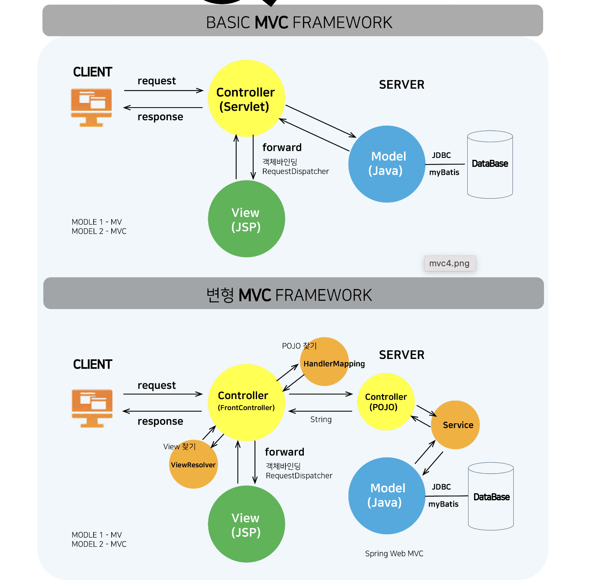
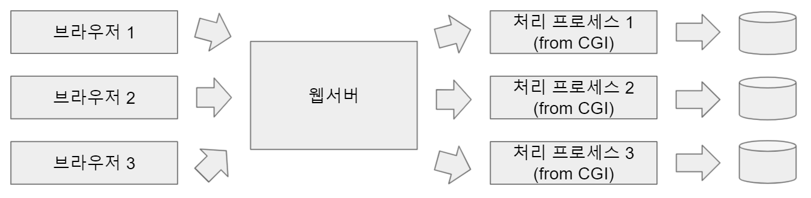
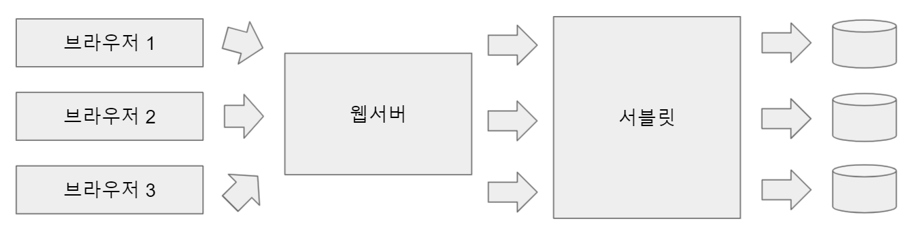
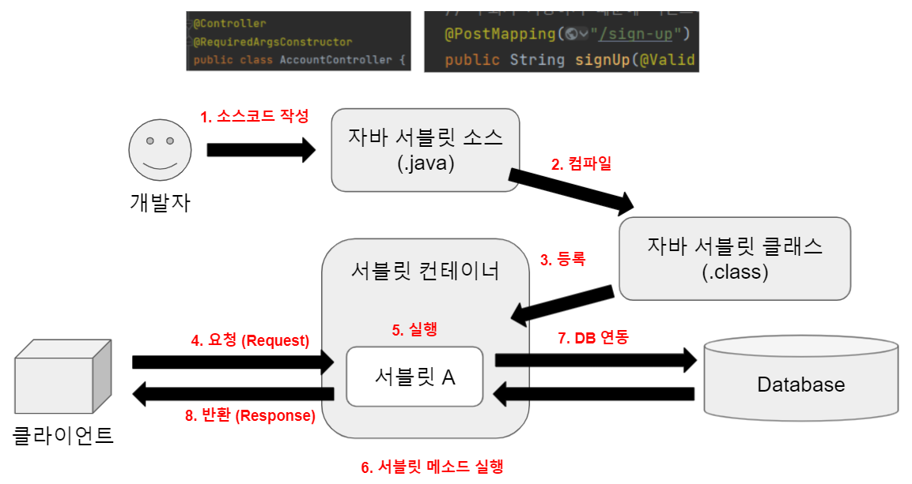
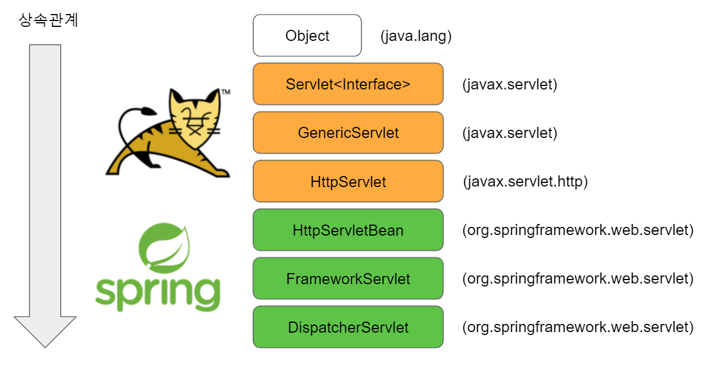

# 서블릿

## 정의

자바 웹 서버로 웹 페이지를 제공할 때, 동적인 데이터를 제공하는 것을 도와주는 친구이다.

이를테면 `index.html`에 `사용자님 환영합니다.`라는 고정 문구 대신에 사용자를 인식한 뒤, `A님 환영합니다.` `B님 환영합니다.` 와 같은 메세지를 출력할 수 있도록 만들어주는 자바 [소프트웨어 컴포넌트](https://en.wikipedia.org/wiki/Software_component)이다.

## 기존 CGI의 단점과 그 단점을 해결한 서블릿

### 기존 CGI의 동작방식

CGI는 브라우저에서 웹서버에 요청이 갔을 때, 각각에 대한 처리 프로세스를 만들어낸다는 단점이 있었다. 그래서 대량의 트래픽을 처리하기에는 약간 무리가 있었다.

### **서블릿의 동작방식**

1. 개발자가 자바 서블릿 소스코드(`.java`)를 작성한다. (위에서는 스프링 프레임워크를 이용해 작성)
2. 해당 자바 서블릿 소스가 빌드시 컴파일되며 서블릿 클래스(`.class`)가 된다.
3. 해당 자바 서블릿 클래스가 톰캣과 같은 서블릿 컨테이너에 등록된다.
4. 클라이언트가 특정 경로에 대한 HTTP Request를 보낸다.
5. HTTP Request에 상응하는 서블릿이 실행된다.
6. 서블릿 메소드(비즈니스 로직)가 실행된다.
7. DB 연동 작업이 있는 경우 DB 연동이 되어 데이터를 CRUD한다.
8. 완성된 데이터를 클라이언트에게 반환해준다.

**스프링 서블릿의 상속 관계**

위와 같은 상속 관계를 갖는다.`HttpServlet`까지는 `WAS`라 불리는 톰캣에서 구현되고, 스프링은 `WAS`로 부터 상속받은 `HttpServlet`을 이용하여 스프링에서 쓰이는 `Servlet`들을 구현한다.
