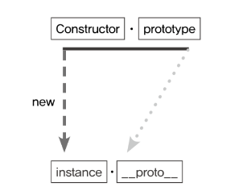
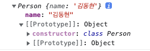
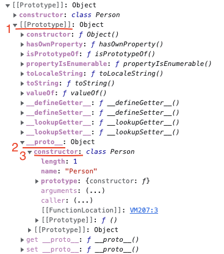
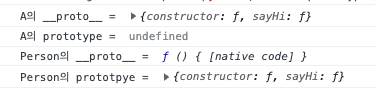
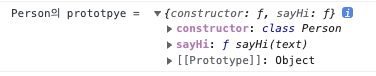
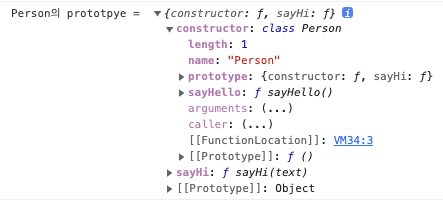

# 프로토타입

## 개요

자바스크립트는 프로토타입 기반 언어이다.

클래스 기반 언어에서는 **상속**을 사용하지만,

자바스크립트에서는 어떤 객체를 원형(**프로토타입**)으로 삼고, 이를 복제(**참조**)함으로써 상속과 비슷한 효과를 얻는다.

즉, `prototype`은 생성자 자체를 뜻하며,

생성자 함수를 통해 만들어진 인스턴스가 생성자를 참조하는 `__proto__` 객체를 통해 상속을 구현한다.

### 참고

- 메서드 : 객체의 동작
- 프로퍼티 : 객체의 상태

## 프로토타입이란?

### 프로토타입 도식화



```jsx
var instace = new Constructor();
```

- 생성자 함수를 통해 객체를 생성한다.
- 이때 생성된 객체는 `__proto__` 프로퍼티가 자동으로 부여된다.
- `__proto__` 프로퍼티는 생성자의 `prototype` 프로퍼티를 참조한다.

### 예시) `prototype`과 `__proto__` 알아보기

```jsx
class Person {
  // 생성자
  constructor(name) {
    this.name = name;
  }
}

var A = new Person("김동현");
console.log(A);
```

**결과**



생성된 객체(인스턴스)는 `[[Prototype]]` → `constructor`와 `[[Prototype]]`을 가진다.



- 이때 생성된 객체는 `__proto__` 프로퍼티가 자동으로 부여된다.
- `__proto__` 프로퍼티는 생성자의 `prototype` 프로퍼티를 참조한다.

자바스크립트는 **함수**에 자동으로 객체인 `prototype` 프로퍼티를 생성해 놓는데,

해당 함수를 생성자 함수로서 사용할 경우, 그로부터 생성된 인스턴스에는 숨겨진 프로퍼티인 `__proto__`가 자동으로 생성되며, 이 프로퍼티는 생성자 함수의 `prototype` 프로퍼티를 참조한다.

### 예시) `Object.prototype` 에 저장되지 않는 메서드?

```jsx
class Person {
  // 생성자
  constructor(name) {
    this.name = name;
  }

  // 프로토타입 메서드
  sayHi(text) {
    return "Hi " + text;
  }

  // 정적 메서드
  static sayHello() {
    console.log("HELLO");
  }
}

var A = new Person("DH");

console.log("A의 __proto__ = ", A.__proto__);
console.log("A의 prototype = ", A.prototype);

console.log("Person의 __proto__ = ", Person.__proto__);
console.log("Person의 prototpye = ", Person.prototype);
```

결과



인스턴스 A

- `__proto__`를 가진다.
- `prototype`은 당연히 없다.

생성자 Person

- `__proto__`는 native code라고 말한다.
- `prototype`을 가진다.



분명, `sayHi` 메서드와 `sayHello` 메서드를 작성했는데, `sayHello`는 보이지 않는다.

`Object.prototype`에는 모든 데이터 타입에서 사용할 수 있는 범용적인 메서드만이 존재한다.



객체 전용 메서드(static)는 여느 데이터 타입과 달리 Object 생성자 함수에 스태틱하게 담겨있다.

정적 프로퍼티/메서드를 사용하기 위해선 인스턴스가 아닌 정의한 생성자 함수에 의해서만 참조/호출할 수 있다.

```jsx
Person.sayHello(); // HELLO
```

### 예시) `__proto__`는 생략이 가능하다.

```jsx
console.log(A.sayHi("반가워!"));
console.log(A.__proto__.sayHi("반가워!"));
```

인스턴스를 통해 메서드를 사용할 경우, `__proto__`을 거쳐야 생성자에 접근하여 메서드를 사용할 수 있을 것 같다. 하지만, 우리는 메서드를 사용하기 위해 `__proto__`를 사용하지 않는다.

`__proto__`는 생략이 가능하다.

그렇기 때문에, 인스턴스가 마치 자신의 것처럼 해당 메서드나 프로퍼티에 접근할 수 있다.

정리하자면,

- 생성자(Constructor) ↔ `prototype`
- 생성 객체(인스턴스) ↔ `__proto__`
- `prototype`은 객체이다. 이를 참조하는 `__proto__` 역시 당연히 객체이다.
- `prototype` 객체 내부에는 인스턴스가 사용할 수 있는 메서드들만이 저장된다. (static 저장 X)
- `__proto__`이 생략 가능하기 때문에 인스턴스에서는 마치 자신의 것처럼 해당 메서드나 프로퍼티에 접근할 수 있게 된다.

## 프로토타입 체인

### 메서드 오버라이드

자식 클래스에서 부모 클래스의 메서드를 재정의할 때 사용하는 기능이다.

용례

- 부모 클래스의 기능을 사용하지 않고 자식 클래스에서 구현한 기능을 사용하고 싶은 경우
- 부모 클래스의 기능을 자식 클래스에서 확장하고 싶은 경우

**예시) 구현을 늦추거나, 자식 클래스에서만 구현한 기능을 사용하고 싶은 경우**

```jsx
var Member = function (name) {
  this.name = name;

  Member.prototype.sayHi = function () {
    return "Hi";
  };

  Member.sayHello = function () {};
  Member.sayBye = function () {};
};

A = new Member("aaaaaaa");

console.log(A.name); //  aaaaaaa
console.log(A.sayHi()); // Hi

/* 오버라이딩을 통해 구현체 구현을 늦출 수 있다. */

// 오버라이딩
var MemberImpl = function (Member) {
  Member.sayHello = function () {
    return "Hello";
  };
};

MemberImpl(A);

// 오버라이딩
A.sayBye = function () {
  return "Bye";
};

console.log(A.sayHello()); // Hello

console.log(A.sayBye()); // Bye
```

### 프로토타입 체인

자바스크립트는 객체의 프로퍼티(메서드 포함)에 접근하려고 할 때, 해당 객체에 접근하려는 프로퍼티가 없다면 `[[Prototype]]` 내부 슬롯의 참조를 따라 자신의 부모 역할을 하는 프로토타입의 프로퍼티를 순차적으로 검색한다.

이를 **프로토타입 체인**이라 한다.

프로토타입 체인의 최상위에 위치하는 객체는 언제나 `Object.prototype` 이다.

그래서 `Object.prototype` (`[[Prototype]]`)을 프로토타입 체인의 종점이라 한다.

종점까지 검색할 수 없는 경우 `undefined`를 반환한다. 오류가 발생하지 않는다!

**따라서 프로토타입 체인은 상속과 프로퍼티 검색을 위한 메커니즘이라 할 수 있다.**

**참고로 스코프 체인은 식별자 검색을 위한 메커니즘이였다.**
