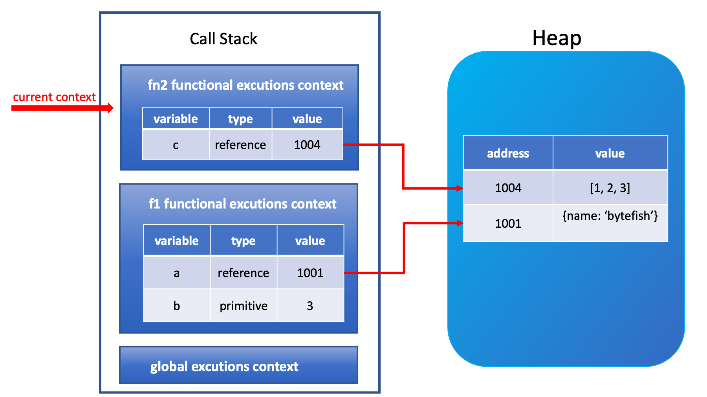
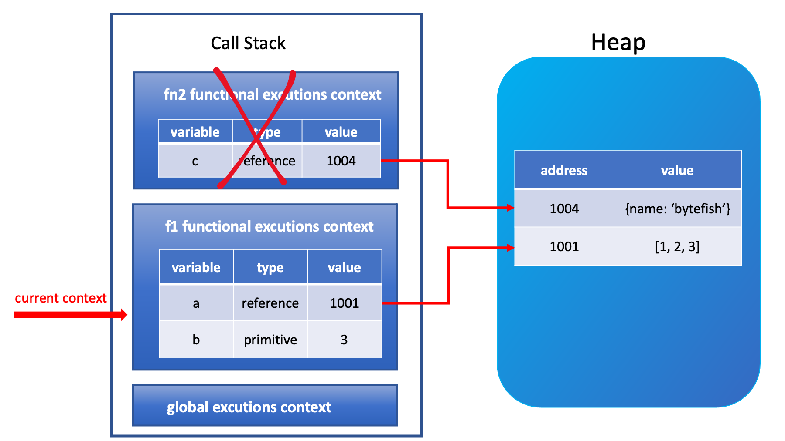
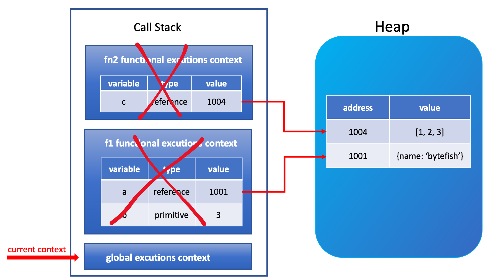
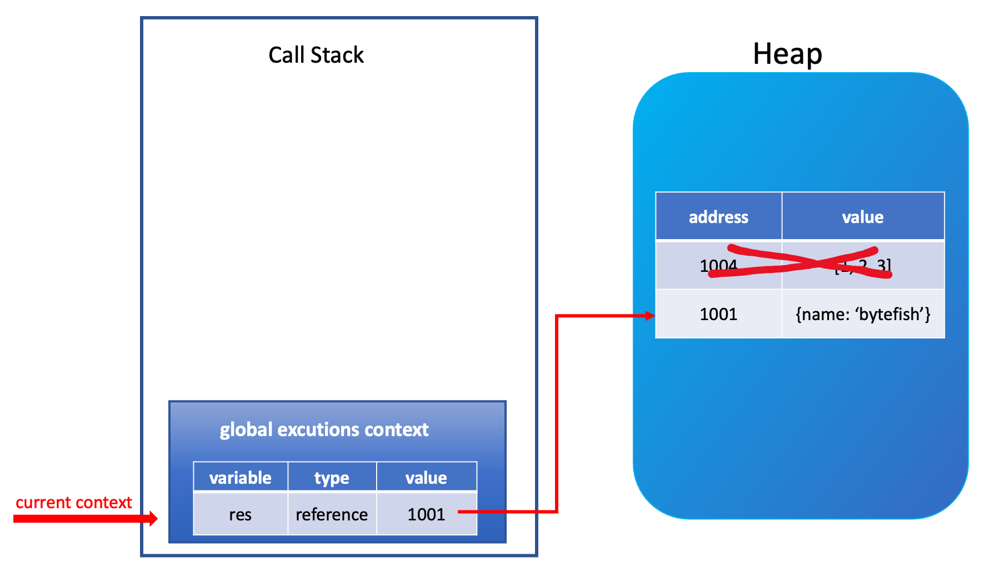

# 자바스크립트의 메모리 누수

## 메모리 누수란?

메모리 누수는 부주의 또는 일부 프로그램 오류로 인해 더 사용되지 않는 메모리를 해제하지 못하는 것이다.

간단히, 어떤 변수가 100M의 메모리를 점유한다고 할 때, 이 변수가 사용되지 않더라도 수동 또는 자동으로 해제되지 않아 계속 메모리를 점유하는 것을 말한다.

## 스택 메모리와 힙 메모리

자바스크립트 메모리는 단순 변수에 사용되는 스택 메모리와 복잡한 객체에 사용되는 힙 메모리로 구분된다.

- 단순 변수들은 원시 타입이라고 불리며 String, Number, Boolean, Null, Undefined, Symbol 등이 있다.
- 복잡한 객체는 참조 데이터 타입이라고 불리며, Object, Array, Function 등이 있다.

### 불변성과 자바스크립트의 메모리 관리

자바스크립트에서 불변성이란 값이나 상태를 변경할 수 없는 것을 의미한다.

원시 타입은 불변성을 지키고 있고, 원시 타입을 제외한 나머지인 참조 타입은 불변성을 지키지 않는다.

예시

```jsx
let str = "A";
str = "B";
```

String은 원시타입인데 이것은 값이나 상태가 변한것이 아닌가?

우리는 이것을 이해하기 위해서 자바스크립트의 메모리에 대해 이해할 필요가 있다.

```jsx
let str = "A";
```

| 변수 주소 | 변수 데이터          | 데이터 주소 | 데이터 값 |
| --------- | -------------------- | ----------- | --------- |
| 1000      | key: str, value:2000 | 2000        | ‘A’       |

```jsx
str = "B";
```

| 변수 주소 | 변수 데이터          | 데이터 주소 | 데이터 값 |
| --------- | -------------------- | ----------- | --------- |
| 1000      | key: str, value:2000 | 2000        | ‘A’       |
|           |                      | 2001        | 'B’       |

str 변수에 새로운 값을 재할당하게 되면, 자바스크립트는 새로운 주소로 데이터를 생성한다. 그리고 변수가 가리키고 있는 데이터 주소를 2001로 변경한다. 즉, 2000이라는 주소를 가진 데이터는 변하지 않았고, 새로운 데이터를 위해 새로운 공간을 마련했으므로 불변성을 지킨 것이다. 이제 GC는 아무곳에서도 사용하지 않는 2000의 ‘A’ 데이터를 수집하여 메모리에서 해제할 것이다.

반면, 참조 타입은 불변성이 없기에 변경이 가능하다.

객체를 변수에 할당하면 실제 객체의 값은 별도의 힙 메모리 공간에 저장되고, 그 공간을 참조하는 주소를 변수는 값으로 갖게 된다. 객체가 저장된 메모리 공간의 주소를 참조값이라고 한다.

```jsx
let a = 1;
let b = 1;
console.log(a === b); // true

const user1 = {
  name: "A",
};

const user2 = {
  name: "A",
};

console.log(user1 === user2); // false
```

객체는 값이 똑같더라도 원시 타입과 다른 결과가 나온다. 값은 같지만 참조값이 다르기 때문이다.

```jsx
let myArray = [];
```

1. 변수의 고유 식별자를 생성합니다.(`myArray`)

2. 콜 스택의 메모리에 주소를 할당합니다.(런타임에 할당될 것입니다.)

3. 힙에 할당된 메모리 주소를 콜스택의 값(`value`)으로 저장합니다.(런타임에 할당될 것입니다.)

4. 힙의 메모리 주소에 할당된 값(`빈 배열 []`)을 저장합니다.

## 자바스크립트의 가비지 컬렉션

앞서 말한 메모리 누수의 정의에 따르면, 변수 또는 데이터가 더 필요하지 않을 때 이들은 가비지 변수 또는 가비지 데이터가 된다. 만약 그런 데이터가 메모리에 계속 쌓인다면, 결국에는 메모리 사용량을 초과하게 될 것이다.

가비지 컬렉션 메커니즘은 수동과 자동 두 가지 범주로 나뉜다.

C와 C++는 수동 정리 메커니즘을 사용한다. 즉 개발자는 변수를 위해 특정 양의 메모리를 할당받고 필요가 없어지면 수동으로 해당 메모리를 비워주어야 한다.

반면, 자바스크립트는 자동 정리 메커니즘을 사용한다. 즉, 모든 것을 자동으로 처리되기 때문에 우리는 얼마나 많은 메모리를 할당하고 비우든지 간에 신경 쓸 필요가 없다. 하지만 그렇다고 메모리 관리에 신경 쓸 필요가 없다는 의미는 아니다! 그렇지 않으면 설명한 대로 메모리 누수가 발생하지 않았을 것이다.

### 자바스크립트 가비지 컬렉션 메커니즘

일반적으로 전역 변수는 자동으로 정리되지 않는다. 그래서 우리는 로컬 스코프 메모리 수집에 초점을 맞출 것이다.

예제

```jsx
function fn1() {
  let a = {
    name: "bytefish",
  };

  let b = 3;

  function fn2() {
    let c = [1, 2, 3];
  }

  fn2();

  return a;
}

let res = fn1();
```

위 코드의 호출 스택을 아래 그림과 같다.



그림의 왼쪽은 스택 영역으로 실행 컨텍스트와 원시 타입의 데이터를 저장하는 데 사용되고 오른편은 힙 영역으로 객체를 저장하는 데 사용된다.

`fn2()`가 실행될 때, 콜 스택 안 실행 컨텍스트는 위에서부터 아래로 다음과 같이 존재한다.

`fn2 함수 실행 컨텍스트` ⇒ `fn1 함수 실행 컨텍스트` ⇒ `전역 실행 컨텍스트`

함수 `fn2`가 실행을 완료할 때, 화살표가 아래로 이동하며 `fn2` 실행 컨텍스트를 종료하게 된다. 그럼 아래 그림과 같이 fn2 실행 컨텍스트가 지워지고 스택 메모리 공간이 해제된다.



함수 `fn1`의 실행이 완료된 후 `fn1` 실행 컨텍스트를 종료할 때, 화살표가 다시 아래로 이동하며 `fn1` 실행 컨텍스트가 지워지고 해당 스택 메모리 공간이 해제된다.



이 시점에서 우리 프로그램은 전역 실행 컨텍스트에 있다.

자바스크립트 가비지 컬렉션은 가끔 호출 스택을 탐색하고 가비지를 수집한다. 이 시점에서 가비지 수집 메커니즘이 수행된다고 가정하자. 가비지 수집기가 호출 스택을 순회할 때 변수 b와 c가 사용되지 않음을 발견하여 가비지 데이터임을 확인하고 표시한다. `fn1` 함수는 실행 후 변수 a를 반환하고 전역 변수 `res`에 저장하므로 활성 데이터로 식별되고 그에 따라 표시한다. 유휴 시간에 가비지 데이터로 표시된 모든 변수는 그림과 같이 해당 메모리를 해제하기 위해 지워진다.



지금까지의 설명을 정리하면 다음과 같다.

1. 자바스크립트의 가비지 수집기 메커니즘은 자동으로 실행되고 태그는 가비지 데이터를 식별하고 정리하는 데 사용된다.
2. 로컬 스코프를 떠난 후 해당 스코프의 변수가 외부 스코프에서 참조되지 않으면 나중에 지워진다.

## 자바스크립트 가비지 컬렉션 메커니즘을 제어하는 두 가지 알고리즘

### 1. 참조 카운팅 알고리즘

먼저 참조가 무엇인지 이해해보자. 두 개의 객체가 주어졌을 때 한 객체가 다른 객체의 메서드나 속성에 접근할 수 있는 경우 이 객체는 다른 객체에 대한 참조값이다.

참조 카운트 알고리즘은 매우 간단하고 다른 객체에 의해 참조되는지 아닌지에 따라 어떤 객체의 유용성을 결정한다. 어던 객체가 다른 객체에 참조되지 않는다면 가비지 값으로 간주하고 수집한다.

```jsx
var obj = {
	property1 : {
		property2 : 10;
	}
}
```

두 객체가 생성되었고 한 객체는 다른 객체의 프로퍼티를 참조한다. 다른 객체는 `obj` 객체에 할당되어 참조된다.

참조를 하고 있으므로 가비지 컬렉션의 범위가 아니게 된다.

```jsx
var newObj = obj;
obj = 10; // obj는 newObj 값에 의해 여전히 참조되므로 GC의 대상이 아닙니다.
```

```jsx
var anotherObj = newObj.property1;
```

`property1`은 두 개의 참조를 가진다.

하나는 `newObj` 변수의 프로퍼티이고 다른 하나는 `anotherObj` 변수로부터 참조 된다.

따라서 가비지 콜렉션의 대상이 아니다.

```jsx
newObj = "Some string";
```

`obj` 변수에 의해 생성된 객체는 더이상 참조를 가지지 않는다.

그러나 `property1`이 `anotherObj` 변수에 의해 참조되므로 가비지 컬렉션의 대상이 되지 않는다.

```jsx
anotherObj = null;
```

이제 어디에서도 `property1` 객체에 대해 참조하지 않는다. 이 상황에서 객체는 가비지 컬렉션의 대상이 된다.

참조 카운팅 알고리즘은 본질적으로 너무 단순해서 이 알고리즘에 완전히 의존하기 어렵다.

```jsx
function foo() {
  var obj1 = {};
  var obj2 = {};
  obj1.a = obj2;
  obj2.a = obj1;
  console.log(obj1);
  console.log(obj2);
}
foo();
```

이러한 순환 참조의 경우 가비지 컬렉션이 처참히 실패할 것이다.

### 2. Mark and Sweep 알고리즘

Mark and Sweep 알고리즘은 객체들에 도달하는 방법으로 GC 메커니즘을 구현한다.

어떤 객체가 도달할 수 없는 거라면 가비지로 인식하여 수집된다. 알고리즘은 **어떤 객체가 전혀 참조되지 않는다면 도달할 수 없다는 원리**를 따르기 때문에 해당 객체를 가비지로 취급한다.

이 과정은 window와 같이 루트 객체를 식별하고 거기서부터 모든 자식 객체들, 그리고 객체들의 자식들을 순회한다. 이 과정에서 도달할 수 없는 일부 객체들이 있다면 그 객체들은 가비지로 수집되고 메모리를 해제한다. 이 알고리즘은 효과적으로 순환 참조 문제를 해결한다.

2012년부터 모든 최신 브라우저들이 Mark and Sweep 알고리즘으로 가비지 컬렉션을 진행

## 메모리 누수 예제들

그래서 어떤 상황들에서 메모리 누수가 발생이 될까? 다음은 공통적인 사례들이다.

- 클로저의 잘못된 사용
- 의도치않게 생성된 전역 변수
- 분리된 DOM 노드
- 콘솔 출력
- 해제하지 않은 타이머

## 결론

자바스크립트 가비지 컬렉션이 자동으로 이루어지지만 특정 변수들의 메모리를 수동으로 해제하는 일이 필요하다.

예를 들자면, 더 필요하지 않은 변수가 외부 변수에 의해 참조되고 있어 메모리가 해제될 수 없을때 **null**을 할당해서 다음 가비지 컬렉션이 동작할 때 메모리를 해제할 수 있다.
