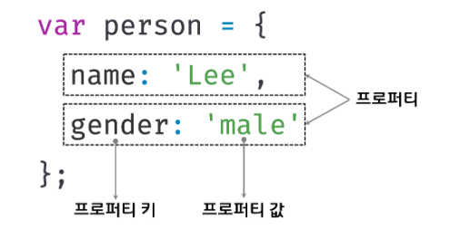
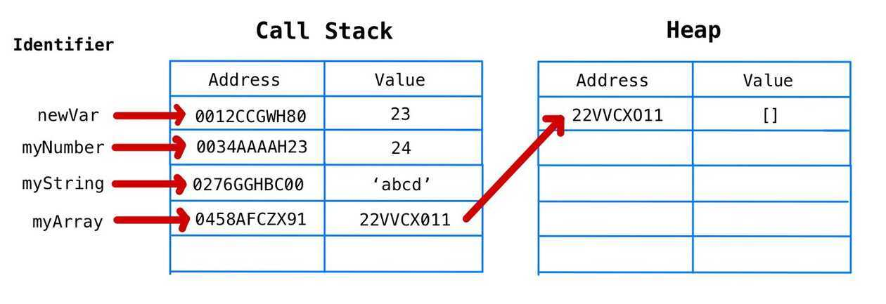
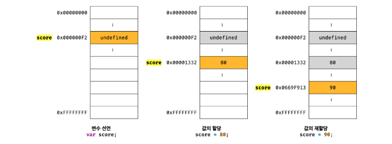
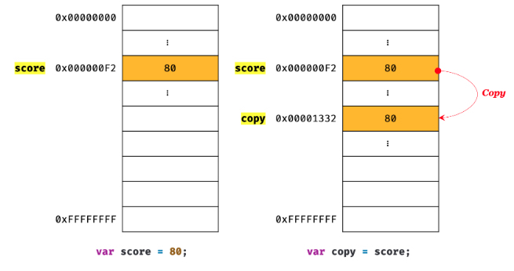
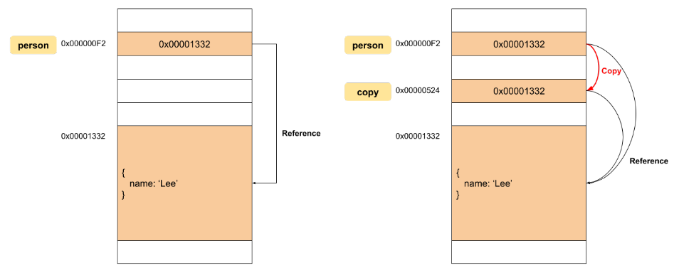

## 객체 리터럴

### 객체란?

자바스크립트는 객체 기반의 프로그래밍 언어이며, 자바스크립트를 구성하는 거의 “모든 것이” 객체다.

원시 값을 제외하면 나머지 값(함수, 배열, 정규 표현식 등)은 모두 객체이다.

객체는 0개 이상의 프로퍼티로 구성된 집합이며, 프로퍼티는 키와 값으로 구성된다.



자바스크립트에서 사용할 수 있는 모든 값은 프로퍼티의 값이 될 수 있다.

자바스크립트의 함수는 일급 객체이므로 값으로 취급할 수 있다. 따라서 함수도 프로퍼티 값으로 사용할 수 있다. 프로퍼티 값이 함수일 경우, 일반 함수와의 구분을 위해 “메서드”라 부른다.

이처럼 객체는 프로퍼티와 메서드로 구성된 집합체다.

- 프로퍼티 : 객체의 상태를 나타내는 값
- 메서드 : 프로퍼티를 참조하고 조작할 수 있는 동작

### 원시 타입 vs 객체 타입

- 원시 타입은 단 하나의 값만 나타내지만, 객체 타입은 다양한 타입의 값을 하나의 단위로 구성한 복합적인 자료구조이다.
- 원시 타입의 값(원시값)은 변경 불가능한 값이지만, 객체의 값(객체)는 변경 가능한 값이다.

### 객체와 함수

자바스크립트의 객체는 함수와 밀접한 관련을 가진다. 함수로 객체를 생성하기도 하며, 함수 자체가 객체이기도 하다.

### 객체 리터럴에 의한 객체 생성

자바스크립트는 프로토타입 기반 객체지향 언어로서 클래스 기반 객체지향 언어와는 달리 다양한 객체 생성 방법을 지원한다.

- 객체 리터럴
- Object 생성자 함수
- 생성자 함수
- Object.create 메서드
- 클래스(ES6)

객체 리터럴은 중괄호(`{…}`) 내에 0개 이상의 프로퍼티를 정의한다. 변수에 할당되는 시점에 자바스크립트 엔진은 객체 리터럴을 해석해 객체를 생성한다.

**예제) 객체 리터럴을 통한 person 객체 생성**

```jsx
var person = {
  name: "LEE",
  sayHello: function () {
    console.log(`Hello! My name is ${this.name}`);
  },
};

console.log(typeof person); // object
console.log(person); // {name: 'LEE', sayHello: ƒ}
```

> **Q. 객체 리터럴의 닫는 중괄호 뒤에 세미콜론을 붙이는 이유?**

> **A. 객체 리터럴은 값으로 평가되는 표현식이기 때문에**

### 프로퍼티

프로퍼티는 키와 값으로 구성된다.

- 프로퍼티 키 : 빈 문자열을 포함하는 모든 문자열 또는 심벌 값
- 프로퍼티 값 : 자바스크립에서 사용할 수 있는 모든 값

프로퍼티 키는 문자열이므로 따옴표로 묶어야 한다. 단, 식별자 네이밍 규칙을 준수하는 이름의 경우 따옴표를 생략할 수 있다. 프로퍼티를 나열할 때는 쉼표(,)로 구분한다.

**식별자 네이밍 규칙**

- 식별자는 문자, 숫자, 언더 스코어(\_)와 특수문자에서는 유일하게 $이를 포함하여 사용할 수 있다.
- 식별자는 숫자로 시작할 수 없다.
- 식별자는 예약어로 분리되는 이름들을 사용할 수 없다. (ex) break, if, void, with, try, var 등등 )
- 변수는 쉼표(,)를 활용하여 여러 개를 한 번에 선언할 수 있다. 하지만 가독성이 낮아지는 선언이므로 가급적 지양한다.

```jsx
var person = {
	firstName: 'first-name',
	'second-name': 'Lee',
	3: 'three',
	function: 'function',
	firstName: 'change-name',
}

console.log(person); {3: 'three', firstName: 'change-name', second-name: 'Lee', function: 'function'}
```

- 프로퍼티 키에 숫자 리터럴을 사용하면 따옴표는 붙지 않지만, 내부적으로는 문자열로 변환된다.
- var, function과 같은 예약어를 사용해도 에러가 발생하지 않는다. 하지만 예상치 못한 에러가 발생할 여지가 있다.
- 이미 존재하는 프로퍼티 키를 중복 선언하면 나중에 선언한 프로퍼티가 먼저 선언한 프로퍼티를 덮어쓴다. 이때 에러가 발생하지는 않는다.

### 프로퍼티 접근

프로퍼티에 접근하는 방법은 다음과 같이 두 가지다.

- 마침표 프로퍼티 접근
- 대괄호 프로퍼티 접근
  - 접근 연산자 내부에 지정하는 프로퍼티 키는 반드시 따옴표로 감싼 문자열이어야 한다.

객체에 존재하지 않는 프로퍼티에 접근하면 undefined를 반환한다. 이때 ReferenceError가 발생하지 않는 데 주의하자.

## 원시 값과 객체의 비교

원시 타입과 객체 타입은 크게 세 가지 측면에서 다르다.

- 불변성
  - 원시 값은 변경 불가능한 값
  - 객체는 변경 가능한 값
- 메모리 할당
  - 원시 값을 변수에 할당하면 변수에는 실제 값이 저장된다.
  - 객체를 변수에 할당하면 변수에는 참조 값이 저장된다.
- 할당에 따른 전달
  - 원시 값을 갖는 변수를 다른 변수에 할당하면 원본의 원시 값이 복사되어 전달된다. (call by value)
  - 객체를 가리키는 변수를 다른 변수에 할당하면 참조 값이 복사되어 전달된다. (call by reference)

### 스택 메모리와 힙 메모리

자바스크립트 메모리는 단순 변수에 사용되는 스택 메모리와 복잡한 객체에 사용되는 힙 메모리로 구분된다.

- 단순 변수들은 원시 타입이라고 불리며 String, Number, Boolean, Null, Undefined, Symbol 등이 있다.
- 복잡한 객체는 참조 데이터 타입이라고 불리며, Object, Array, Function 등이 있다.

### 불변성과 자바스크립트의 메모리 관리

자바스크립트에서 불변성이란 값이나 상태를 변경할 수 없는 것을 의미한다.

원시 타입은 불변성을 지키고 있고, 원시 타입을 제외한 나머지인 참조 타입은 불변성을 지키지 않는다.

예시

```jsx
let str = "A";
str = "B";
```

String은 원시타입인데 이것은 값이나 상태가 변한것이 아닌가?

우리는 이것을 이해하기 위해서 자바스크립트의 메모리에 대해 이해할 필요가 있다.

```jsx
let str = "A";
```

| 변수 주소 | 변수 데이터          | 데이터 주소 | 데이터 값 |
| --------- | -------------------- | ----------- | --------- |
| 1000      | key: str, value:2000 | 2000        | ‘A’       |

```jsx
str = "B";
```

| 변수 주소 | 변수 데이터          | 데이터 주소 | 데이터 값 |
| --------- | -------------------- | ----------- | --------- |
| 1000      | key: str, value:2000 | 2000        | ‘A’       |
|           |                      | 2001        | 'B’       |

str 변수에 새로운 값을 재할당하게 되면, 자바스크립트는 새로운 주소로 데이터를 생성한다. 그리고 변수가 가리키고 있는 데이터 주소를 2001로 변경한다. 즉, 2000이라는 주소를 가진 데이터는 변하지 않았고, 새로운 데이터를 위해 새로운 공간을 마련했으므로 불변성을 지킨 것이다. 이제 GC는 아무곳에서도 사용하지 않는 2000의 ‘A’ 데이터를 수집하여 메모리에서 해제할 것이다.

반면, 참조 타입은 불변성이 없기에 변경이 가능하다.

객체를 변수에 할당하면 실제 객체의 값은 별도의 힙 메모리 공간에 저장되고, 그 공간을 참조하는 주소를 변수는 값으로 갖게 된다. 객체가 저장된 메모리 공간의 주소를 참조값이라고 한다.

```jsx
let a = 1;
let b = 1;
console.log(a === b); // true

const user1 = {
  name: "A",
};

const user2 = {
  name: "A",
};

console.log(user1 === user2); // false
```

객체는 값이 똑같더라도 원시 타입과 다른 결과가 나온다. 값은 같지만 참조값이 다르기 때문이다.

```jsx
let myArray = [];
```

1. 변수의 고유 식별자를 생성합니다.(`myArray`)

2. 콜 스택의 메모리에 주소를 할당합니다.(런타임에 할당될 것입니다.)

3. 힙에 할당된 메모리 주소를 콜스택의 값(`value`)으로 저장합니다.(런타임에 할당될 것입니다.)

4. 힙의 메모리 주소에 할당된 값(`빈 배열 []`)을 저장합니다.



### 원시값

원시 값은 변경 불가능한 값이다. 다시 말해, 한번 생성된 원시 값은 읽기 전용 값으로서 변경할 수 없다.

먼저, 변수와 값은 구분해서 생각해야한다. 변수는 하나의 값을 저장하기 위해 확보된 메모리 공간 자체 또는 그 메모리 공간을 식별하기 위해 붙인 이름이고, 값은 변수에 저장된 데이터로서 표현식이 평가되어 생성된 결과를 말한다. **따라서 변경 불가능하다는 것은 변수가 아니라 값에 대한 진술이다.**

즉, “원시 값은 변경 불가능하다”는 말은 원시 값 자체를 변경할 수 없다는 것이지 변수 값을 변경할 수 없다는 것은 아니다. 변수는 언제든지 재할당을 통해 변수 값을 교체할 수 있다.



변수에 할당된 원시 값이 변경 불가능한 값이기 때문에 재할당 시, 변수가 가리키던 메모리 공간의 주소가 바뀐 모습이다.

값에 의한 전달

```jsx
var score = 80;
var copy = score;

console.log(score); // 80
console.log(copy); // 80

console.log(score === copy); // true

score = 100;

console.log(score); // 100
console.log(copy); // 80

console.log(score === copy); // false
```

copy 변수에 원시 값을 갖는 score 변수를 할당하면 할당받는 변수(copy)에는 원시 값 80이 복사되어 전달된다.

score 변수와 copy 변수의 값 80은 다른 메모리 공간에 저장된 별개의 값이다! 따라서 score 변수의 값을 변경해도 copy 변수의 값에는 어떠한 영향도 주지 않는다.



엄격하게 표현하면 “값에 의한 전달”도 사실은 값을 전달하는 것이 아니라 메모리 주소를 전달한다. 단, 전달된 메모리 주소를 통해 메모리 공간에 접근하면 값을 참조할 수 있다.

### 객체

객체(참조) 타입의 값, 즉 객체는 변경 가능한 값이다.

객체에 할당된 변수를 참조하면 메모리에 저장되어 있는 **참조 값**을 통해 실제 객체에 접근한다.

- 참조 값은 생성된 객체가 저장된 메모리 공간의 주소, 그 자체이다.



객체를 변경할 때 마다 원시 값처럼 이전 값을 복사해서 새롭게 생성한다면 명확하고 신뢰성이 확보되겠지만, 객체는 크기가 매우 클 수 도 있고, 원시 값처럼 크기가 일정하지도 않으며, 프로퍼티 값이 객체일 수도 있어서 복사해서 생성하는 비용이 많이 든다. 다시 말해, 메모리의 효율적 소비가 어렵고 성능이 나빠진다.

띠라서 객체는 변경 가능한 값으로 설계되어 있다.

참조에 의한 전달

```jsx
var person  {
	name : 'Lee'
}

var copy = person;
```


위 그림처럼 원본 person을 사본 copy에 할당하면 원본 person의 참조 값을 복사해서 copy에 저장한다. 즉, 두개 의 식별자가 하나의 객체를 공유한다. 따라서 원본 또는 사본 중 어느 한쪽에서 객체를 변경하면 서로 영향을 주고 받는다.
