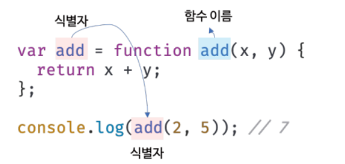
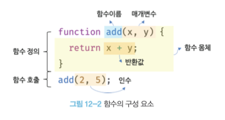

## 함수란?

---

함수는 자바스크립트에서 가장 중요한 핵심 개념이다. 또 다른 자바스크립트의 핵심 개념인 스코프, 실행 컨텍스트, 클로저, 생성자 함수에 의한 객체 생성, 메서드, this, 프로토타입, 모듈화 등이 모두 함수와 깊은 관련이 있다.

### 수학에서의 함수

입력을 받아 출력을 내보내는 일련의 과정을 정의한 것이다.

예를 들어, f(x, y) = x + y라는 함수를 정의하고 이 함수에 두 개의 입력 2, 5를 전달하면 함수는 정의된 일련의 과정(x + y)를 실행하여 7을 출력한다.

### 프로그래밍에서의 함수

수학의 함수와 같은 개념이다. 위의 예시인 f(x, y) = x + y를 자바스크립트 함수로 표현하면 다음과 같다.

```jsx
function add(x, y) {
  return x + y;
}

add(2, 5); // 7
```

프로그래밍 언어의 함수는 일련의 과정을 문으로 구현한 뒤, 코드 블록으로 감싸서 하나의 실행 단위로 정의한 것이다. 함수 내부로 입력을 전달받는 변수를 매개 변수, 입력을 인수, 출력을 반환값이라 한다.

또, 함수는 값이며, 여러 개 존재할 수 있으므로 특정 함수를 구별하기 위해 식별자인 함수 이름을 사용할 수 있다.

## 함수를 사용하는 이유

---

### 코드의 재사용

함수는 필요할 때 여러 번 호출할 수 있다. 즉, 실행 시점을 개발자가 결정할 수 있고 몇 번이든 재사용이 가능하다.

따라서, 코드의 재사용이라는 측면에서 매우 유용하다.

### 코드의 신뢰성 향상

함수를 사용하지 않고 같은 코드를 중복해서 여러 번 작성하며 수정해야 할 때 중복된 횟수만큼 코드를 수정해야 한다. 코드의 중복을 억제하고 재사용성을 높이는 함수는 유지보수의 편의성을 높이고 실수를 줄여 코드의 신뢰성을 높이는 효과가 있다.

### 코드의 가독성 향상

함수는 객체 타입의 값이다. 따라서 이름(식별자)를 붙일 수 있다. 적절한 함수 이름은 함수의 내부 코드를 이해하지 않고도 함수의 역할을 파악할 수 있게 돕는다. 코드는 동작하는 것만이 존재 목적이 아니라 개발자를 위한 문서이기도 하다. 따라서 사람이 이해할 수 있는 코드, 즉 가독성이 좋은 코드가 좋은 코드다.

## 자바스크립트 함수의 특징

---

### 함수는 ‘호출할 수 있는 객체’이다.

자바스크립트의 함수는 객체 타입의 값이다. 따라서 생성 시, 함수 리터럴을 통해 생성할 수 있다. 함수 리터럴은 function 키워드, 함수 이름, 매개 변수 목록, 함수 몸체로 구성된다.

구성

- 함수 이름 : 식별자, 생략 가능(익명 함수)
- 매개변수 목록 : 매개변수 목록은 순서에 의미가 있다.
- 함수 몸체 : 함수 호출 시, 일괄적으로 실행될 문들을 하나의 실행 단위로 정의한 코드 블록

함수는 객체이긴 하지만, 일반 객체와는 다르다. 일반 객체는 호출할 수 없지만 함수는 호출할 수 있다.

다시 말해, 자바스크립트의 함수는 ‘호출할 수 있는 객체’이다.

## 함수 정의

---

함수는 함수 정의를 통해 생성한다. 자바스크립트의 함수는 다양한 방법으로 정의할 수 있다.

### 함수 선언문

```jsx
function add(x, y) {
  return x + y;
}
```

함수 선언문은 함수 리터럴과 형태가 동일하다. 단, 함수 리터럴은 함수 이름을 생략할 수 있으나 함수 선언문은 함수 이름을 생략할 수 없다.

함수 선언문은 표현식 아닌 문이다. 자바스크립트 엔진은 함수 선언문을 해석해 함수 객체를 생성한다.

이때 함수 이름은 함수 몸체 내부에서만 유효한 식별자이므로 함수 이름과는 별도로 생성된 함수 객체를 가리키는 식별자가 필요하다.

따라서 자바스크립트 엔진은 생성된 함수를 호출하기 위해 함수 이름과 동일한 식별자를 암묵적으로 생성하고, 거기에 함수 객체를 할당한다.



함수는 함수 이름으로 호출하는 것이 아니라 함수 객체를 가리키는 식별자로 호출한다. 즉, 함수 선언문으로 생성한 함수를 호출한 것은 함수 이름 add가 아니라 자바스크립트 엔진이 암묵적으로 생성한 식별자 add인 것이다. 함수 이름과 변수 이름이 일치하므로 함수 이름으로 호출되는 듯하지만 **사실은 식별자로 호출된 것이다.**

### 함수 표현식

```jsx
var add = function (x, y) {
  return x + y;
};
```

자바스크립트의 함수는 객체 타입의 값이다. 자바스크립트의 함수는 값처럼 변수에 할당할 수도 있고 프로퍼티 값이 될 수도 있으며 배열의 요소가 될 수도 있다. 이처럼 값의 성질을 갖는 객체를 일급 객체라 한다. **즉, 자바스크립트의 함수는 일급 객체다.**

함수는 일급 객체이므로 함수 리터럴로 생성한 함수 객체를 변수에 할당할 수 있다. 이러한 정의 방식을 함수 표현식이라 한다.

### 함수 생성 시점과 함수 호이스팅

```jsx
console.dir(add); // ƒ add(x, y)
console.dir(sub); // undefined

console.log(add(2, 5)); // 7
console.log(sub(2, 5)); // TypeError: sub is not a function

/* 함수 선언문 */
function add(x, y) {
  return x + y;
}

/* 함수 표현식 */
var sub = function (x, y) {
  return x + y;
};
```

위 예제와 같이 함수 선언문으로 정의한 함수는 함수 선언문 이전에 호출할 수 있다. (함수 호이스팅 O)

그러나, 함수 표현식으로 정의한 함수는 함수 표현식 이전에 호출할 수 없다. (변수 호이스팅 O)

이러한 이유는 각각의 함수 생성 시점이 다르기 때문이다.

**선언문**

모든 선언문이 그렇듯 함수 선언문도 런타임 이전에 자바스크립트 엔진에 의해 먼저 실행된다. 즉, 함수 선언문도 런타임 이전에 함수 객체가 먼저 생성된다. 위에서 살펴봤듯이 자바스크립트 엔진이 함수 이름과 동일한 이름의 식별자를 암묵적으로 생성하고 생성된 함수 객체를 할당한다.

**변수 호이스팅과 함수 호이스팅**

- 공통점 : 런타임 이전에 자바스크립트 엔진에 의해 먼저 실행되어 식별자를 생성한다.
- 차이점 : 변수 선언문 이전에 변수를 참조하면 undefined로 평가되지만, 함수를 함수 선언문 이전에 호출하면 호출이 가능하다.

**표현식**

함수 표현식은 변수에 할당되는 값이 함수 리터럴인 문이다. 따라서 함수 표현식은 변수 선언문과 변수 할당문을 한번에 기술한 축약 표현과 동일하게 동작한다. 변수 선언은 런타임 이전에 실행되어 undefined로 초기화되지만 변수 할당문의 값은 할당문이 실행되는 시점, 즉 런타임에 평가되므로 함수 표현식의 함수 리터럴문도 할당문이 실행되는 시점에 평가되어 함수 객체가 된다.

따라서, 함수 표현식으로 함수를 정의하면 함수 호이스팅이 아닌 변수 호이스팅이 발생한다.

- 함수 표현식 이전에 함수를 참조하면 undefined로 평가된다.
- 함수 표현식 이전에 함수를 호출하면 타입 에러가 발생한다.

### Function 생성자 함수

```jsx
var add new Function('x', 'y', 'return x+ y');
```

Function 생성자로 함수를 생성하는 방식은 일반적이지 않으며, 바람직하지도 않다. Function 생성자 함수로 생성한 함수는 클로저를 생성하지 않는 등 함수 선언문이나 표현식으로 생성한 함수와 다르게 동작한다.

### 화살표 함수

```jsx
var add = (x, y) => x + y;
```

화살표 함수는 항상 익명 함수로 정의한다.

화살표 함수는 기존의 함수 선언문 또는 함수 표현식을 완전히 대체하기 위해 디자인된 것은 아니다. 화살표 함수는 기존의 함수보다 표현만 간략한 것이 아니라 내부 동작 또한 간략화되어 있다.

화살표 함수는 생성자 함수로 사용할 수 없으며, 기존 함수와 this 바인딩 방식이 다르고, prototype 프로퍼티가 없으며 arguments 객체를 생성하지 않는다.

## 함수 호출

---

### 매개변수와 인수

함수를 실행하기 위해 필요한 값을 함수 외부에서 함수 내부로 전달할 필요가 있는 경우, 매개변수를 통해 인수를 전달한다.



매개변수는 함수 몸체 내부에서만 참조할 수 있고 함수 몸체 외부에서는 참조할 수 없다.

함수는 매개변수의 개수와 인수의 개수가 일치하는지 체크하지 않는다.

## 참조에 의한 전달과 외부 상태의 변경

---

매개변수도 함수 몸체 내부에서 변수와 동일한게 취급되므로 매개변수 또한 타입에 따라 값에 의한 전달, 참조에 의한 전달 방식을 그대로 따른다.

### 예시

```jsx
function changeVal(primitive, obj) {
  primitive += 100;
  obj.name = "Kim";
}

var num = 100;
var person = { name: "Lee" };

console.log(num); // 100
console.log(person); // {name : "Lee"}

changeVal(num, person);

// 원시 값은 원본이 훼손되지 않음.
console.log(num); // 100;

// 객체는 원본이 훼손됨.
console.log(person); // {name : "Kim"}
```

## 다양한 함수의 형태

---

### 즉시 실행 함수

함수 정의와 동시에 즉시 호출되는 함수를 즉시 실행 함수(IIFE)라고 한다. 즉시 실행 함수는 단 한번만 호출되며 다시 호출할 수 없다.

```jsx
(function () {
  var a = 3;
  var b = 5;
  return a * b;
})();
```

즉시 실행 함수는 함수 이름이 없는 익명 함수를 사용하는 것이 일반적이다.

### 재귀 함수

함수가 자기 자신을 호출하는 것을 재귀 호출이라 한다. 재귀 함수는 자기 자신을 호출하는 행위, 즉 재귀 호출을 수행하는 함수를 말한다.

```jsx
var factorial = function foo(n) {
  if (n <= 1) return 1;

  return n * factorial(n - 1);
};

console.log(factorial(5)); // 120
```

### 중첩 함수

함수 내부에 정의된 함수를 중첩 함수 또는 내부 함수라 한다.

### 콜백 함수

콜백 함수는

- 다른 함수의 인자(파라미터)로써 넘겨지는 함수
- 특정 이벤트에 의해 호출되는 함수

**예시) addEventListener**

```jsx
button.addEventListener("click", myFunction);

function myFunction() {
  document.getElementById("demo").innerHTML = "Hello World";
}
```

**addEventListener 함수에 안에 myFunction 함수를 넘겨주므로 myFunction 함수는 콜백 함수이다.**

매개 변수를 통해 함수의 외부에서 콜백 함수를 전달받은 함수는 고차 함수(Higher-Order Function)라 한다.

**예시) 콜백 함수를 사용하는 고차 함수 map(), filter(), reduce()**

```jsx
// 콜백 함수를 사용하는 고차 함수 map
var res = [1, 2, 3].map(function (item) {
  return item * 2;
});

console.log(res); // [2, 4, 6]

// 콜백 함수를 사용하는 고차 함수 filter
res = [1, 2, 3].filter(function (item) {
  return item % 2;
});

console.log(res); // [1, 3];

// 콜백 함수를 사용하는 고차 함수 reduce
res = [3, 4, 5, 6].reduce(function (acc, cur) {
  return acc * cur; // f(f(f(3, 4), 5), 6)
});

console.log(res); // 360;
```

**설명**

콜백을 넘겨받는 코드(고차 함수)는 이 콜백을 필요에 따라 즉시 실행할 수 있거나, 나중에 실행할 수 있다.

즉, 콜백 함수는 고차 함수에 의해 호출 시점이 결정된다.

자바스크립트에서 함수를 인자로 넘기는 것이 가능한 이유는 함수를 “일급 객체”로 취급하기 때문이다.

(참고로, 콜백 함수는 자바스크립트에 국한된 개념이 아닌 프로그래밍에서 통용되는 개념이다. 그렇기 때문에 다른 언어에서는 콜백 함수의 전달을 포인터, 서브 루틴, 람다함수 등의 형태로 한다.)

**예시) 덧셈을 출력하는 로직**

1. 단순한 구현 방법

```jsx
function add(x, y) {
  return x + y;
}

function printResult(result) {
  console.log(result);
}

printResult(add(10, 2)); // 프린트 함수 호출 -> 덧셈 함수 호출
```

1. 콜백 함수를 사용한 구현.

콜백 함수가 다른 곳에서도 필요하거나, 자주 호출되는 경우에 외부에서 콜백 함수를 정의한 후 참조를 통해 전달한다.

```jsx
function add(x, y, print) {
  print(x + y);
}

function printResult(result) {
  console.log(result);
}

add(10, 20, printResult); // printResult 함수를 인자로 전달(함수 형태가 아니다!)
```

1. 익명 함수를 통한 콜백 함수 사용

주로 고차 함수 내부에만 호출되는 경우 사용된다.

```jsx
function add(x, y, print) {
  print(x + y);
}

add(10, 20, (result) => {
  console.log(result);
});
```

1. [참고] C에서 포인터를 통한 콜백 함수 구현

```c
#include <stdio.h>

int add(int a, int b) {
	return a + b;
}

int main() {
	int(*fp)(int, int);  // 함수포인터 선언 - '반환자료형(*이름)(인자 자료형, 인자 자료형)'
	fp = add;
	printf("%d", fp(1, 2));
}
```

**용도**

**01. 순차적 실행을 보장하고 싶을 때 사용한다.**

- 특정 이벤트 발생 후 실행

예시) “1” 출력하고 “2”출력하기

1. 단순하게 구현하기.

```jsx
function printOne() {
  console.log("1");
}

function printTwo() {
  console.log("2");
}

printOne();
printTwo();
```

1. 콜백 함수로 구현하기.

```jsx
function printOne(afterPrintOne) {
  console.log("1");
  afterPrintOne();
}

function printTwo() {
  console.log("2");
}

printOne(printTwo); // 함수를 인자로 넘긴다.
```

**02. 로직의 추상화를 위해 사용된다.**

예시) N까지 숫자 출력, N까지 숫자 중 홀수만 출력하기.

```jsx
// N까지 숫자 출력
function repeat(n) {
  for (var i = 0; i < n; i++) {
    console.log(i);
  }
}

repeat(5); // 0 1 2 3 4
```

여기서, N까지의 숫자 중 홀수만 출력하는 기능도 만들고 싶다라고 가정하자.

repeat 함수는 console.log(i)에 강하게 의존하고 있어 다른 일을 할 수 없다. 그러므로 repeat 함수의 반복문 내부에서 다른 일을 하려면 함수를 새롭게 작성하는 수 밖에 없다.

```jsx
// N까지 숫자 출력
function repeat(n) {
  for (var i = 0; i < n; i++) {
    console.log(i);
  }
}

repeat(5); // 0 1 2 3 4

// N까지 숫자 중 홀수만 출력
function repeat2(n) {
  for (var i = 0; i < n; i++) {
    if (i % 2) console.log(i);
  }
}

repeat(5); // 1 3
```

살펴보면, N까지 for문을 돌리는 것은 중복되지만 for문 내부에서 하는 일이 다른 것을 볼 수 있다.

이를 함수를 합성하는 것으로 해결할 수 있다. (고차 함수는 콜백 함수를 자신의 일부분으로 합성한다.)

```jsx
// 중복: N까지 for문을 도는 것
function repeat(n, f) {
  for (var i = 0; i < n; i++) {
    f(i);
  }
}

// 분리 1: 모두 출력
var printAll = function (i) {
  console.log(i);
};

// 분리 2: 홀수만 출력
var printOdds = function (i) {
  if (i % 2) console.log(i);
};

repeat(5, printAll); // 0 1 2 3 4
repeat(5, printOdds); // 1 3
```

**콜백 함수의 장단점**

---

장점

- 함수를 인자로 받기 때문에 필요에 따라 함수의 정의를 달리해 전달할 수 있다.
- 함수를 굳이 정의하지 않고 익명 함수로도 전달이 가능하다.
- 비동기 처리 방식의 문제점을 해결할 수 있다. (함수 제어권을 위임했기 때문.)

단점(정확히는 비동기 처리에서의 단점)

- 콜백함수의 남용은 코드 가독성을 해친다.(콜백 지옥)
- 비동기 처리 중 발생한 에러의 처리가 어렵다.

### 순수 함수와 비순수 함수

함수형 프로그래밍에서 어떤 외부 상태에 의존하지도 않고 변경하지도 않는 함수를 순수 함수라 한다.

즉, 동일한 인수가 전달되면 언제나 동일한 값을 반환하는 함수이다.

함수형 프로그래밍은 순수 함수와 보조 함수의 조합을 통해 외부 상태를 변경하는 부수 효과를 최소화해서 불변성을 지향하는 프로그래밍 패러다임이다.
