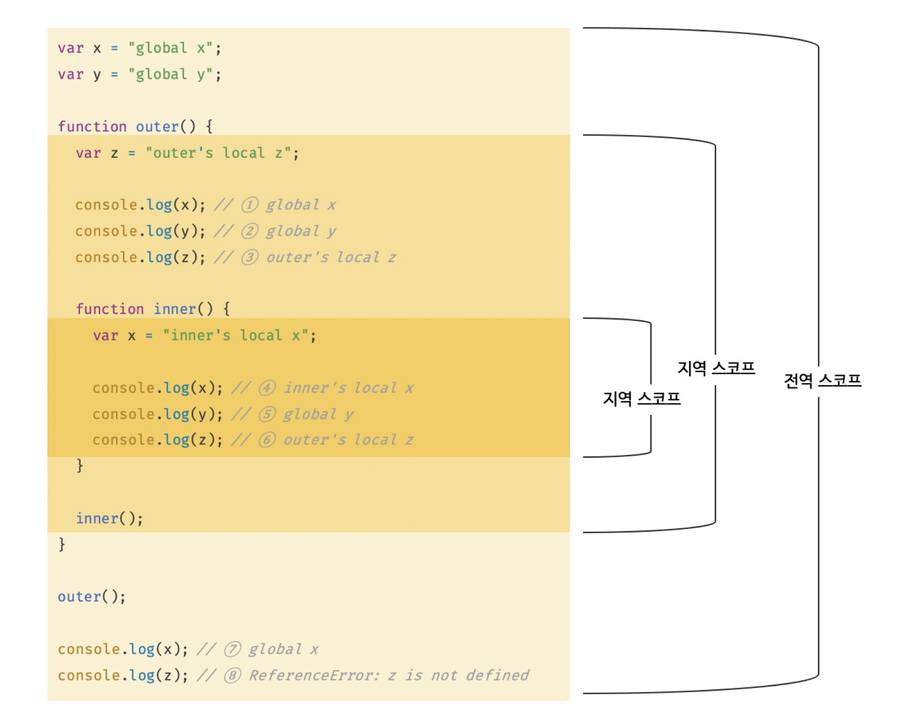
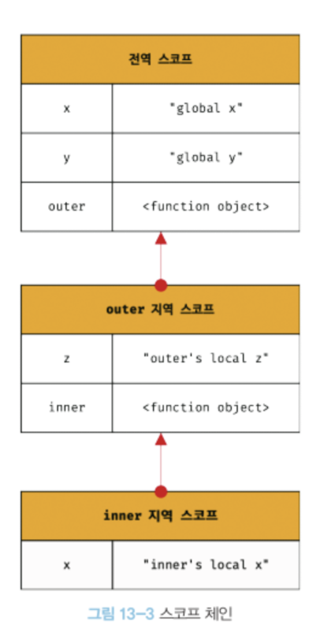

# 스코프

## 정의

스코프(유효범위)는 자바스크립트를 포함한 모든 프로그래밍 언어의 기본적이며 중요한 개념이다.

더욱이 자바스크립트의 스코프는 다른 언어의 스코프와 구별되는 특징이 있으므로 주의가 필요하다.

**예시. 함수의 매개변수**

```jsx
function add(x, y) {
  console.log(x, y); // 2, 5
  return x + y;
}

add(2, 5);

console.log(x, y); // error: x is not defined
```

우리는 스코프를 이미 경험했다. 함수의 매개변수는 함수 몸체 내부에서만 참조할 수 있고, 함수 몸체 외부에서는 참조할 수 없다. 이것은 매개변수를 참조할 수 있는 유효범위, 즉 매개변수의 스코프가 함수 몸체 내부로 한정되기 때문이다.

모든 식별자(변수 이름, 함수 이름, 클래스 이름 등)는 자신이 선언된 위치에 의해 다른 코드가 식별자 자신을 참조할 수 있는 유효 범위가 결정된다. 이를 스코프라 한다.

**즉, 스코프는 식별자가 유효한 범위를 말한다.**

**예시. 식별자 결정**

```jsx
var x = "global";

function foo() {
  var x = "local";
  console.log(x); // 1번
}

foo();

console.log(x); // 2번
```

함수 외부와 내부에 동일한 이름을 갖는 변수 x를 정의했다. 이때 1번, 2번에서는 x를 참조하는 데 이름이 같은 두개의 변수 중에서 어떤 변수를 참조해야 할 것인지를 결정해야한다.

이때 자바스크립트 엔진은 스코프를 통해 어떤 변수를 참조해야할 것인지 결정한다.

또, 만약 스코프라는 개념이 없다면 같은 이름을 갖는 변수는 충돌을 일으키므로 프로그램 전체에서 하나밖에 사용할 수 없다.

## 스코프의 종류



전역

- 코드의 가장 바깥 영역
- 전역은 전역 스코프를 만듦.
- 전역에 변수 선언 시 전역 스코프를 갖는 전역 변수가 됨.
- 전역 변수는 어디서든 참조할 수 있음.

지역

- 함수 몸체 내부
- 지역은 지역 스코프를 만듦.
- 지역에 변수를 선언하면 지역 스코프를 갖는 변수가 됨.
- 지역 변수는 자신의 지역 스코프와 하위 지역 스코프에서 유효함.

## 스코프 체인

함수는 중첩될 수 있다. 그러므로 함수의 지역 스코프도 중첩될 수 있다. 이는 스코프가 함수의 중첩에 의해 계층적 구조를 갖는다는 것을 의미한다.



이처럼 모든 스코프는 하나의 계층적 구조로 연결된다. 이렇게 스코프가 계층적으로 연결된 것을 스코프 체인이라 한다.

변수를 참조할 때 자바스크립트 엔진은 스코프 체인을 통해 변수를 참조하는 코드의 스코프에서 시작하여 상위 스코프 방향으로 이동하며 선언된 변수를 검색한다. 이 때문에 상위 스코프에서 선언한 변수를 하위 스코프에서도 참조할 수 있다.

예시. 스코프 체인에 의한 함수 검색

```jsx
function foo() {
  console.log("global foo");
}

function bar() {
  function foo() {
    console.log("local foo");
  }
  foo(); // 1번
}

bar(); // local foo;
```

1번에서 foo 함수를 호출하면 자바스크립트 엔진은 함수를 호출하기 위해 먼저 함수를 가리키는 식별자 foo를 검색한다. 이처럼 함수도 식별자에 할당되기 때문에 스코프를 갖는다.

따라서 스코프는 “변수를 검색할 때 사용하는 규칙”이라고 표현하기 보다 “식별자를 검색하는 규칙”이라고 표현하는 편이 좀 더 적합하다.

## 함수 레벨 스코프

지역은 함수 몸체 내부를 말하고 지역은 지역 스코프를 만든다. 이는 코드 블록이 아닌 함수에 의해서만 지역 스코프가 생성된다는 의미다.

C나 자바 등을 비롯한 대부분의 프로그래밍 언어는 함수 몸체만이 아니라 모든 코드 블럭(if, for, while 등)이 지역 스코프를 만든다. 이러한 특성을 **블록 레벨 스코프**라 한다.

하지만 var 키워드로 선언된 변수는 오로지 함수의 코드 블록(함수 몸체)만을 지역 스코프로 인정한다. 이러한 특성을 **함수 레벨 스코프**라 한다.

**예시. var 키워드 - 함수 레벨 스코프**

```jsx
var x = 1;

if (true) {
  var x = 10;
}

console.log(x); // 10;

var i = 10;

for (var i = 0; i < 5; i++) {
  console.log(i); // 0 1 2 3 4
}

console.log(i); // 5
```

함수 밖에서 var 키워드로 선언된 변수는 코드 블록 내에서 선언되었다 할지라도 모두 전역 변수다.

따라서 x는 전역 변수다. 이미 선언된 전역 변수 x가 있으므로 x 변수는 중복 선언된다. 이는 의도치 않게 변수 값이 변경되는 부작용을 발생시킨다.

## 렉시컬 스코프

“함수를 어디서 정의했는지에 따라 함수의 상위 스코프를 결정한다.“

```jsx
var x = 1;

function foo() {
  var x = 10;
  bar();
}

function bar() {
  console.log(x);
}

foo(); // 1
bar(); // 1
```

자바스크립트를 비롯한 대부분의 프로그래밍 언어는 렉시컬 스코프를 따른다.

함수 정의가 평가되는 시점에 상위 스코프가 정적으로 결정되기 때문에 정적 스코프라고 부르기도 한다.

**예제 실행 과정**

1. bar 함수는 전역에서 정의된 함수이다.
2. 함수 선언문으로 정의된 bar 함수는 전역코드가 실행되기 전에(런타임 이전) 평가되어 함수 객체를 생성한다.
3. 생성된 bar 함수 객체는 자신이 정의된 스코프(전역 스코프)를 기억한다.
4. bar 함수 호출 시, 언제나 자신이 기억하고 있는 전역 스코프를 상위 스코프로 사용한다.

# 전역 변수의 문제점

## 변수의 생명 주기

변수는 생성되고 소멸되는 생명 주기를 가진다. 만약 변수에 생명 주기가 없다면 한번 선언된 변수는 프로그램을 종료하지 않는 한 영원히 메모리 공간을 점유하게 된다.

변수는 자신이 선언된 위치에서 생성되고 소멸한다.

### 지역 변수의 생명 주기

함수 내부에서 선언된 지역 변수는 함수가 호출되면 생성되고 함수가 종료하면 소멸한다.

예제.

```jsx
function foo() {
  var x = "local";
  console.log(x); // local
  return x;
}

foo();
console.log(x); // error : x is not defined
```

지역 변수 x는 foo 함수가 호출되기 이전까지는 생성되지 않는다. foo 함수를 호출하지 않으면 함수 내부의 변수 선언문이 실행되지 않기 때문이다.

변수 선언은 런타임 이전 단계에서 자바스크립트 엔진에 의해 먼저 실행된다. 이는 전역 변수에 한정된 것이다.

함수 내부에서 선언한 변수는 함수가 호출된 직후에 함수 몸체의 코드가 한 줄씩 순차적으로 실행되기 이전에 자바스크립트 엔진에 의해 먼저 실행된다.

**즉, 지역 변수의 생명 주기는 함수의 생명 주기와 일치한다.**

그런데 지역 변수가 함수보다 오래 생존하는 경우도 있다. (클로저)

변수는 하나의 값을 저장하기 위해 확보한 메모리 공간 자체 또는 그 메모리 공간을 식별하기 위해 붙인 이름이다. 따라서 변수의 생명 주기는 메모리 공간이 확보된 시점부터 해제되어 가용 메모리 풀에 반환되는 시점까지다.

함수 내부에서 선언된 지역 변수는 함수가 생성한 스코프에 등록된다.

함수가 생성한 스코프는 렉시컬 환경이라 부르는 물리적 실체가 있다. 따라서 변수는 자신이 등록한 스코프가 소멸될 때 까지 유효하다.

할당된 메모리 공간은 더 이상 그 누구도 참조하지 않을 때 가비지 콜렉터에 의해 해제되어 가용 메모리 풀에 반환된다. 즉 누군가가 메모리 공간을 참조하고 있으면 해제되지 않고 확보된 상태로 남아 있게 된다. 마찬가지로 누군가 스코프를 참조하고 있으면 스코프는 소멸하지 않고 생존하게 된다.

### 전역 변수의 생명 주기

전역 코드는 함수 호출과 같이 실행하는 특별한 진입점이 없고 코드가 로드되자마자 곧바로 해석되고 실행된다. 종료의 경우 마지막 문이 실행되어 더 이상 실행할 문이 없을 때 종료한다.

var 키워드로 선언한 전역 변수의 생명 주기는 전역 객체의 생명 주기와 일치한다.

## 전역 변수의 문제점

### 암묵적 결합

전역 변수를 선언한 의도는 어디서든 참조하고 할당할 수 있는 변수를 사용하겠다는 것이다.

이는 모든 코드가 전역 변수를 참조하고 변경할 수 있는 “암묵적 결합”을 허용하는 것이다.

변수의 유효 범위가 크면 클수록 코드의 가독성을 나빠지고 의도치 않게 상태가 변경될 수 있는 위험성도 높아진다.

### 긴 생명 주기

전역 변수는 생명 주기가 길다. 따라서 메모리 리소스도 오랜 기간 소비한다. 또 전역 변수의 상태를 변경할 수 있는 시간도 길고 기회도 많다. 더욱이 var 키워드는 변수의 중복 선언을 허용하므로 변수 이름이 중복되어 의도치 않은 재할당이 이뤄질 수 있다.

### 스코프 체인 상에서 종점에 존재

전역 변수는 스코프 체인 상 종점에 존재한다. 즉, 전역 변수의 검색 속도가 가장 느리다.

### 네임스페이스 오염

자바스크립트의 가장 큰 문제점 중 하나는 파일이 분리되어 있다 해도 하나의 전역 스코프를 공유한다는 것이다.

따라서 다른 파일 내에서 동일한 이름으로 명명된 전역 변수나 전역 함수가 같은 스코프 내에 존재할 경우 예상치 못한 결과를 가져올 수 있다.

### 즉시 실행 함수

함수 정의와 동시에 호출되는 즉시 실행 함수는 단 한 번만 호출된다.

모든 코드를 즉시 실행 함수로 감싸면 모든 변수는 즉시 실행 함수의 지역 변수가 된다.

```jsx
(function () {
  var foo = 10; // 즉시 실행 함수의 지역 변수
})();

console.log(foo); // ReferenceError: foo is not defined
```

### 네임스페이스 객체

전역에 네임스페이스 역할을 담당할 객체를 생성하고 전역 변수처럼 사용하고 싶은 변수를 프로퍼티로 추가하는 방법이다.

```jsx
var MYAPP = {}; // 전역 네임스페이스 객체

MYAPP.name = "Lee";

console.log(MYAPP.name); // Lee
```

네임스페이스를 분리해서 식별자 충돌을 방지하는 효과는 있으나 네임스페이스 객체 자체가 전역 변수에 할당되므로 그마지 유용해 보이지 않는다.

### 모듈 패턴

클래스를 모방해서 관련이 있는 변수와 함수를 모아 이를 즉시 실행 하수로 감싸 하나의 모듈을 만드는 방법이다.

모듈 패턴은 자바스크립트의 강력한 기능인 클로저를 기반으로 동작한다.

```jsx
var Counter = (function () {
  var num = 0;

  return {
    increase() {
      return ++num;
    },
    decrease() {
      return --num;
    },
  };
})();

// private 변수화
console.log(Counter.num); // undefined

console.log(Counter.increase()); // 1
console.log(Counter.increase()); // 2
console.log(Counter.decrease()); // 1
console.log(Counter.decrease()); // 0
```

모듈 패턴의 특징은 “전역 변수의 억제”와 “캡슐화”를 구현할 수 있다는 것이다.

위 예제의 즉시 실행 함수는 객체(`num`)를 반환한다.

- `public` : 외부에 노출하고 싶은 변수나 함수를 return에 작성
- `private` : 외부로 노출하고 싶지 않은 변수나 함수는 함수 내부에 작성

### ES6 모듈

ES6 모듈은 파일 자체의 독자적인 모듈 스코프를 제공한다. 따라서 모듈 내에서 var 키워드로 선언한 변수는 더는 전역 변수가 아니며 window 객체의 프로퍼티도 아니다.

script 태그에 `type=”module”` 어트리뷰트를 투가하면 로드된 자바스크립트 파일은 모듈로서 동작한다.

```jsx
<script type="module" src="lib.mjs"></script>
<script type="module" src="app.mjs"></script>
```

ES6 모듈은 IE를 포함한 구형 브라우저에서는 동작하지 않으며, 브라우저의 ES6 모듈 기능을 사용하더라도 트랜스파일링이나 번들링이 필요하기 때문에 아직까지는 브라우저가 지원하는 ES6 모듈 기능보다는 Webpack 등의 모듈 번들러를 사용하는 것이 일반적이다.
