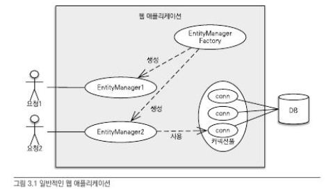

# JPA 기초 - 영속성 관리

## JPA가 제공하는 기능

1. 엔티티와 테이블을 매핑하는 설계 부분
2. 매핑한 엔티티를 실제 사용하는 부분

<br>

## 목표

> 매핑한 엔티티를 엔티티 매니저를 통해 어떻게 사용하는지 알아보자 <br>

엔티티 매니저는 엔티티를 저장, 수정, 삭제 , 조회하는 등 엔티티와 관련된 모든 일을 처리한다.<br>
개발자 입장에서 엔티티 매니저는 엔티티를 저장하는 가상의 데이터베이스로 이해하면 된다.

## 엔티티 매니저 팩토리와 엔티티 매니저

### EntityManagerFactory 생성

<br>

```java
EntitiyManagerFactory emf = Persistence.createEntitiyManagerFactory("jpabook");
```

위 코드를 호출하면 `META_INF/persistence.xml` 에 있는 정보를 바탕으로 EntityManagerFactory를 생성한다. <br>
이제부터 필요할 때마다 엔티티 매니저 팩토리에서 엔티티 매니저를 생성하면 된다. <br>

```java
EntitiyManager em = emf.createEntitiyManager();
```

엔티티 매니저 팩토리는 이름 그래도 엔티티 매니저를 만드는 공장이다. <br>
공장을 만드는 비용이 상당하다보니, 한 개만 만들어서 애플리케이션 전체에서 공유하도록 설계되어 있다. <br>

**엔티티 매니저 팩토리는 여러 스레드가 동시에 접근해도 안전하므로 서로 다른 스레드 간에 공유해도 되지만,** <br>
**엔티티 매니저는 여러 스레드가 동시에 접근하면 동시성 문제가 발생하므로 스레드 간에 절대 공유하면 안된다.**



- 엔티티 매니저는 데이터베이스 연결이 꼭 필요한 시점까지 커넥션을 얻지 않는다.
- **트랙잭션을 시작할 때 커넥션을 획득한다.**

<br>

### 영속성 컨텍스트

JPA를 이해하는 데 가장 중요한 용어는 “**영속성 컨텍스트”이다.** <br>

영속성 컨텍스트는 “**엔티티를 영구 저장하는 환경**”이라는 뜻이다. <br>
엔티티 매니저로 엔티티를 저장하거나 조회하면 엔티티 매니저는 영속성 컨텍스트에 엔티티를 보관하고 관리한다. <br>
영속성 컨텍스트는 엔티티 매니저를 생성할 때 하나 만들어진다. 그리고 엔티티 매니저를 통해서 영속성 컨텍스트에 접근할 수 있고, 영속성 컨텍스트를 관리할 수 있다. <br>

**엔티티의 생명주기**

엔티티의 4가지 상태 <br>

1. 비영속 : 영속성 컨텍스트와 전혀 관계가 없는 상태
2. 영속 : 영속성 컨텍스트에 저장된 상태
3. 준영속 : 영속성 컨텍스트에 저장되었다가 분리된 상태
4. 삭제 : 삭제된 상태

**영속성 컨텍스트의 특징**

영속성 컨텍스트의 특징은 다음과 같다.

- 영속성 컨텍스트와 식별자 값

  - 영속성 컨텍스트는 엔티티를 식별자 값(@Id로 테이블의 기본키와 매핑한 값)으로 구분한다.
  - 영속 상태는 식별자 값이 반드시 있어야한다. 없을 시, 예외가 발생한다.

<br>

- 영속성 컨텍스트와 데이터베이스 저장
  - 영속성 컨텍스트에 엔티티를 저장하면 이 엔티티는 언제 데이터베이스에 저장될까?
  - JPA는 보통 트랜잭션을 커밋하는 순간 영속성 컨텍스트에 새로 저장된 엔티티를 데이터베이스에 반영한다. ⇒ “**플러시**”

<br>

- 영속성 컨텍스트가 엔티티를 관리하는 장점
  - 1차 캐시
  - 동일성 보장
  - 트랜잭션을 지원하는 쓰기 지연
  - 변경 감지
  - 지연 로딩

### 엔티티 조회

영속성 컨텍스트는 내부에 캐시를 가지고 있는데 이것을 **“1차 캐시”**라 한다. <br>
영속 상태의 엔티티는 모두 이곳에 저장된다. <br>

```java
// 엔티티 생성 - 비영속
Member member = new Member();
member.setId("member1");
member.setUserName("회원1");

// 엔티티 영속
em.persist(member);
```

1. 1차 캐시에 회원 엔티티를 저장한다. (회원 엔티티는 아직 데이터베이스에 저장되지 않음.)

1차 캐시의 키는 식별자 값이다. 이는 데이터베이스 기본 키와 매핑되어 있다. <br>
영속성 컨텍스트에 데이터를 저장하고 조회하는 모든 기준은 데이터베이스 기본 키 값이다. <br>

```java
// 엔티티 조회(entitiyClass, primaryKey)
Member member = em.find(Member.class, "member1");
```

em.find()를 호출하면 먼저 1차 캐시에서 엔티티를 찾고, 만약 찾는 엔티티가 없으면 데이터베이스에서 조회한다. <br>

1차 캐시 조회 <br>

1. 식별자 값으로 엔티티를 찾는다.
2. 있으면 메모리에 있는 1차 캐시에서 엔티티를 조회하고, 없으면 데이터베이스에서 조회한다.

데이터베이스에서 조회 <br>

2.1 데이터베이스에서 조회해서 엔티티를 생성한다. <br>
2.2 그리고 1차 캐시에 저장한 후에 영속 상태의 엔티티를 반환한다.

**영속 엔티티의 동일성 보장** <br>

```java
Member a = em.find(Member.class, "member1");
Member b = em.find(Member.class, "member1");

System.out.println(a == b) // 동일
```

em.find(Member.class, “member1”)을 반복해서 호출해도 영속성 컨텍스트는 1차 캐시에 있는 같은 엔티티 인스턴스를 반환한다. <br>
따라서 영속성 컨텍스트는 성능상 이점과 엔티티의 동일성을 보장한다. <br>

JPA는 1차 캐시를 통해 반복 가능한 읽기 등급의 **트랜잭션 격리 수준**을 데이터베이스가 아닌 애플리케이션 차원에서 제공한다는 장점이 있다. <br>

<br>

### 엔티티 등록

```java
EntitiyManager em = emf.createEntitiyManager();
EntitiyTransaction transaction = em.getTransaction();

// 엔티티 매니저는 데이터 변경 시 트랜잭션을 시작해야 한다.
transaction.begin();  // [트랜잭션] 시작

em.persist(memberA);
em.persist(memberB);
// 여기까지 INSERT SQL을 데이터베이스에 보내지 않는다.

// 커밋하는 순간 데이터베이스에 INSERT SQL을 보낸다.
transaction.commit();  // [트랜잭션] 커밋
```

1. 엔티티 매니저는 트랜잭션을 커밋하기 직전까지 데이터베이스에 엔티티를 저장하지 않고 내부 쿼리 저장소에 [INSERT SQL]을 차곡차곡 모아둔다. <br>
2. 트랜잭션을 커밋할 때 모아둔 쿼리를 데이터베이스에 보내는데 이것을 **“트랙잰션을 지원하는 쓰기 지연”**이라 한다. <br>
3. 영속성 컨텍스트는 1차 캐시에 회원 엔티티를 저장하면서 동시에 회원 엔티티 정보로 등록 쿼리를 만든다. 그리고 만들어진 등록 쿼리를 쓰기 지연 SQL 저장소에 보관한다. <br>
4. 트랜잭션을 커밋하면 엔티티 매니저는 우선 영속성 컨텍스트를 플러시한다. 플러시는 영속성 컨텍스트의 변경 내용을 데이터베이스에 동기화하는 작업인데 이때 등록, 수정, 삭제한 엔티티를 데이터베이스에 반영한다.

<br>

### 엔티티 수정

**SQL 수정 쿼리의 문제점** <br>

SQL을 사용하면 수정 쿼리를 직접 작성해야 한다. 프로젝트가 점차 커지면서 요구사항이 늘어나고 쿼리도 추가된다. <br>

```java
UPDATE MEMBER
SET
	NAME=?,
	AGE=?
// 추가
	GRADE=?
WHERE
	id=?
```

이런 개발 방식의 문제점은 비즈니스 로직을 분석하기 위해 SQL을 계속 확인해야 한다. 결국 직접적이든 간접적이든 비즈니스 로직이 SQL에 의존하게 된다. <br>

<br>

**JPA의 엔티티 변경 감지** <br>

```java
// 엔티티 조회
Member memberA = em.find(Member.class, "memberA");

// 영속 엔티티 데이터 수정
memberA.setUsername("hi");
memberA.setAge(10);
```

JPA로 엔티티를 수정할 때는 단순히 엔티티를 조회해서 데이터만 변경하면 된다. <br>
트랜잭션 커밋 직전에 update를 해야할 것만 같지만, 이런 메서드는 없다. 그럼 엔티티의 데이터만 변경했는데 어떻게 데이터베이스에 반영이 되는걸까? <br>

이렇게 엔티티의 변경사항을 데이터베이스에 자동으로 반영하는 기능을 “**변경 감지**”라 한다. <br>

JPA는 엔티티를 영속성 컨텍스트에 보관할 때, 최초 상태를 복사해서 저장해두는데 이것을 **“스냅샷”**이라 한다. <br>
그리고 플러시 시점에 스냅샷과 엔티티를 비교해서 변경된 엔티티를 찾는다. <br>

1. 트랜잭션 커밋 → 엔티티 매니저 내부에서 플러시 호출
2. 엔티티와 스냅샷 비교 → 변경된 엔티티 찾기
3. 변경된 엔티티가 있으면 수정 쿼리를 생성해서 쓰기 지연 SQL 저장소에 보낸다.
4. 쓰기 지연 저장소의 SQL을 데이터베이스에 보낸다.
5. 데이터베이스 트랜잭션을 커밋한다.

<br>

**변경 감지는 영속성 컨텍스트가 관리하는 영속 상태의 엔티티에만 적용된다.** <br>
비영속, 준영속처럼 영속성 컨텍스트의 관리를 받지 못하는 엔티티는 값을 변경해도 데이터베이스에 반영되지 않는다. <br>

수정된 부분만의 쿼리를 생성하는 게 아닌, JPA의 기본 전략인 엔티티의 모든 필드를 업데이트한다. 왜 그럴까? <br>

- 모든 필드를 사용하면 수정 쿼리가 항상 동일하다. 따라서 애플리케이션 로딩 시점에 수정 쿼리를 미리 생성해두고 재사용할 수 있다.
- 데이터베이스에 동일한 쿼리를 보내면 데이터베이스는 이전에 한 번 파싱된 쿼리를 재사용할 수 있다.

### 엔티티 삭제

1. 엔티티를 삭제하려면 먼저 삭제 대상 엔티티를 조회해야 한다.
2. em.remove()에 삭제 대상 엔티티를 넘겨주면 엔티티를 삭제한다. 물론 엔티티를 즉시 삭제하는 것이 아니라 엔티티 등록과 비슷하게 삭제 쿼리를 쓰기 지연 SQL 저장소에 등록된다.
3. 이후 트랜잭션을 커밋해서 플러시를 호출하면 실제 데이터베이스에 삭제 쿼리를 전달한다.

참고로, em.remove(memberA)를 호출하는 순간 memberA는 영속성 컨텍스트에서 제거된다. <br>
이렇게 삭제된 엔티티는 재사용하지 말고 자연스럽게 가비지 컬렉션의 대상이 되도록 두는 것이 좋다. <br>
