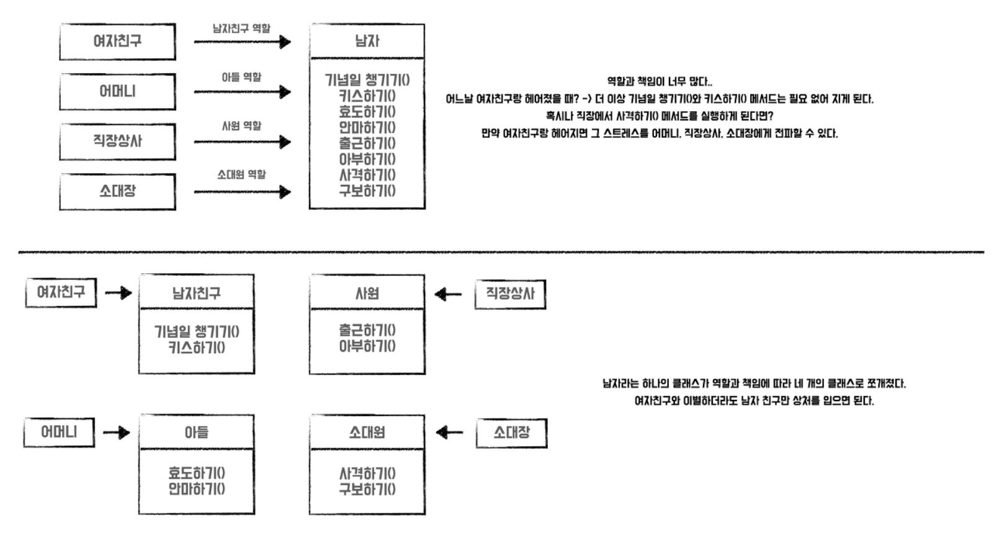
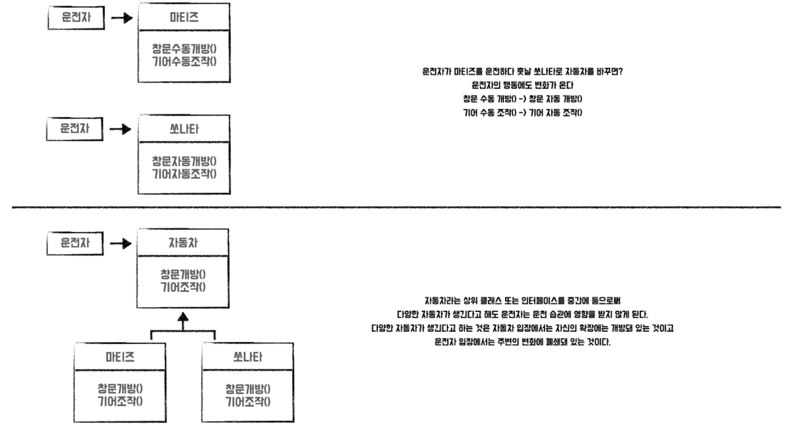
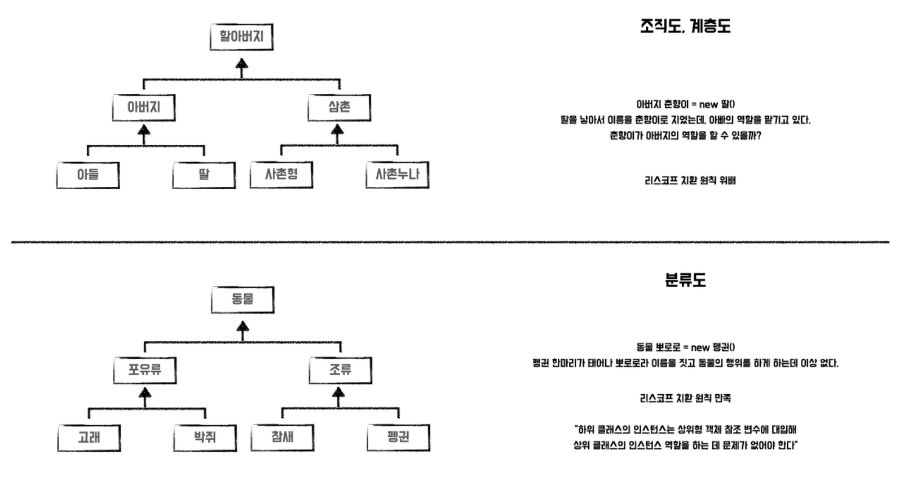
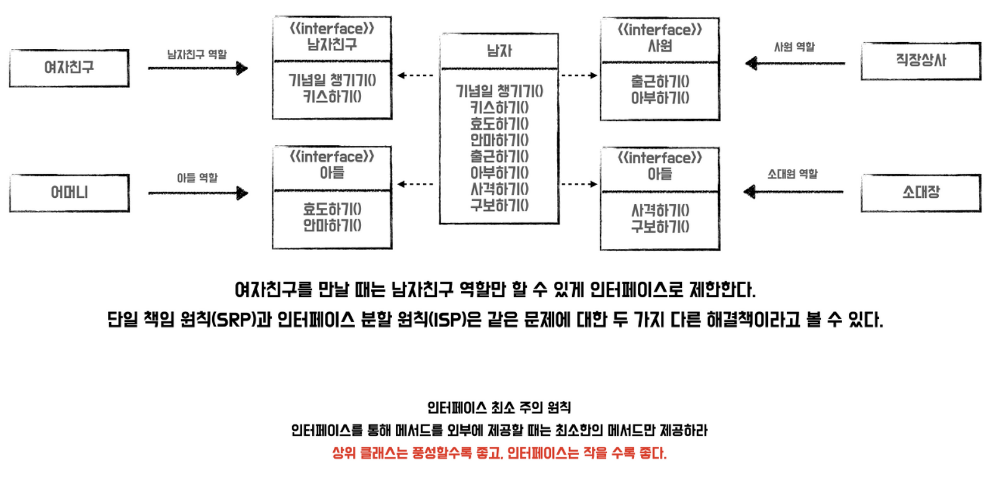
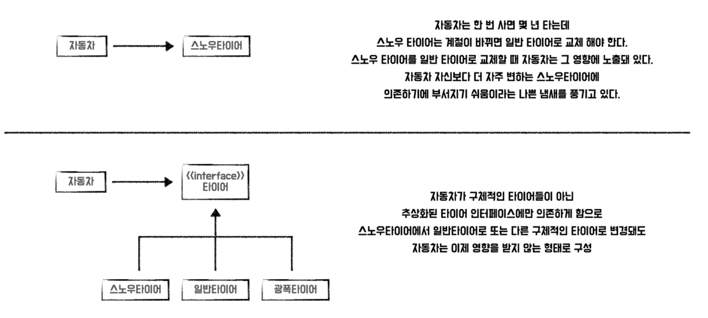

## 스프링과 객체 지향 프로그래밍

### 스프링의 탄생 배경과 핵심 컨셉

**탄생 배경**
스프링은 과거 EJB(Enterprise Java Bean)을 통한 개발이 의존적 개발을 강제하여 복잡한 프로그래밍에 어려움은 느껴 탄생하였다. (여기서 의존적 개발은 특정 환경, 기술에 종속적인 코드 작성을 말한다.)

스프링은 자바 언어의 가장 큰 특징인 '객체 지향 언어'의 특징을 통해 '좋은 객체 지향' 애플리케이션을 개발하도록 도와주는 프레임워크이다.

스프링 프레임워크의 기술들

- 핵심 기술 : 스프링 DI 컨테이너, AOP 등
- 웹 기술 : 스프링 MVC, 스프링 WebFlux 등
- 데이터 접근 : 트랜잭션, JDBC, ORM 지원, XML 지원 등

### 좋은 객체 지향 프로그래밍

객체 지향 프로그래밍은 객체들의 모임으로 각각의 객체들이 협력해야한다.
프로그램, 작게는 컴포넌트를 쉽고 유연하게 변경하면 개발해야한다.

1. 캡슐화 : 접근 제한자

2. 추상화 : 클래스 도출

3. 상속 : 재사용 + 확장

4. 다형성 : 역할(인터페이스)과 구현(구현 클래스)의 분리
   - 클라이언트는 대상의 역할만 알도록 설계
   - 클라이언트가 구현 대상의 내부 구조를 알지 못하도록하여 변경에 영향을 받으면 안된다.

스프링은 IoC(제어의 역전), DI(의존관계 주입)과 같은 다형성을 활용하여 역할과 구현을 편리하게 다룰 수 있도록 지원한다.

### 객체 지향 설계의 5가지 원칙(SOLID)

**SRP : 단일 책임 원칙**
"하나의 클래스는 하나의 책임만 가져야 한다." <br>

어떤 변화에 의해 클래스를 변경해야 하는 이유는 오직 하나뿐이어야함을 의미한다.
이를 통해 책임을 적절히 분배하여 코드의 가독성 향상, 유지 보수의 이점을 누리는 것이 목표이다. (어떤 기능을 수정하더라도, 연관없는 기능에는 영향이 가지 않게끔)

적용 방법
목표 : 여러 원인에 의해 변경되는 하나의 클래스 분할하기



1. 클래스를 통해 혼재된 각 책임을 개별 클래스로 분할하기
2. 책임만 분리하는 것이 아닌 분리된 두 클래스간의 관계의 복잡도 줄이기
3. 만약, 비슷한 책임을 중복해서 갖고 있다면 `SuperClass`를 사용하기
4. 올바른 클래스 이름을 통해 책임을 나타내기

책임이란 것이 모호하지만, '변경'에 따른 파급 효과가 적으면 단일 책임 원칙을 잘 따른 것이다.

**OCP : 개방-폐쇄 원칙**
"소프트웨어 요소는 확장에는 열려있으나 변경에는 닫혀있어야 한다." <br>

요구사항의 변경이나 추가사항이 발생하더라도, 기존 구성요소는 수정이 일어나지 말아야 하며, 기존 구성요소를 쉽게 확장해서 재사용할 수 있어야한다는 뜻이다.

적용 방법
목표 : 변경되지 않을 추상된 인터페이스와 추가사항, 기능변경에 대응하는 구현체 작성하기



1. 변경(확장)될 것과 변하지 않을 것을 엄격히 구분하기
2. 가능한 인터페이스의 변경 억제 => 적당한 추상화 레벨 선택
3. 다형성을 활용하여 인터페이스의 새로운 구현체(클래스) 생성

적용 이슈
다형성을 활용했을지라도, 구현체를 바꾸는 과정에서 OCP 원칙을 준수할 수 없는 경우가 발생한다. 왜냐하면 갈아끼우기 위해 기존의 것은 지우고, 새로 만든 것을 붙여야하므로. (기존 코드의 변경 발생!)

스프링 컨테이너가 객체를 생성하고 연관관계를 맺어주는 별도의 조립 도구(설정자)의 역할을 통해 이를 해결한다. (기존 코드를 변경하지 않기 위해 외부에서 이를 제어.)

**LSP : 리스코프 치환 원칙**
"프로그램의 객체는 정확성을 깨뜨리지 않으면서 하위 타입의 인스턴스로 바꿀수 있어야 한다."

서브 타입은 언제나 자신의 기반(base type)으로 교체할 수 있어야 함을 의미한다.
즉, "하위 클래스 is a kind of 상위 클래스", "구현 클래스 is able to 인터페이스"를 만족한다.



적용 사례 : Colletcion 인터페이스의 활용

```Java
void f() {
   LinkedList list = new LinkedList();
   modify(List);
}

void modify(LinkedList list) {
   list.add(...);
   doSomethingWith(list);
}
```

List 자료구조만 사용할 것이라면 이 코드도 문제없지만, 만약 속도 개선을 위해 HashSet을 사용해야 하는 경우가 발생한다면 골치가 아프다.
LinkedList와 HashSet은 모두 Colletcion 인터페이스를 상속하므로 다음과 같이 작성하는 것이 바람직하다.

```Java
void f() {
   Collection list = new HashSet();
   modify(List);
}

void modify(Collection list) {
   list.add(...);
   doSomethingWith(list);
}
```

적용 방법

1. 혼동될 여지가 없고 트레이드 오프를 충분히 고려한 선택이라면 그대로 둔다.
2. 다형성에서 하위 구현체는 인터페이스의 규약을 다 지켜야한다. (인터페이스 메소드를 구현한 구현체를 믿고 사용하기 위함.)

**ISP : 인터페이스 분리 원칙**
"클라이언트는 자신이 사용하지 않는 메서드에 의존 관계를 맺으면 안된다." <br>

하나의 범용 인터페이스보다는, 여러 개의 구체적인 인터페이스가 낫다란 의미이다.
즉, 인터페이스를 명확하게 작성하여 대체 가능성을 높이기 위한 방법이다.
SRP가 클래스의 단일책임을 강조한다면, ISP는 인터페이스의 단일책임을 강조한다.



**DIP : 의존관계 역전 원칙**
"구현 클래스에 의존하지 말고, 추상화된 것에 의존해야한다." <br>

추상을 매개로 객체 간 메시지를 주고 받음으로써 관계를 최대한 느슨하게 만드는 원칙이다.



적용 방법

1. 역할(인터페이스)와 구현(구현 클래스)의 철저히 분리한 뒤, 역할에 의존하도록 설계
