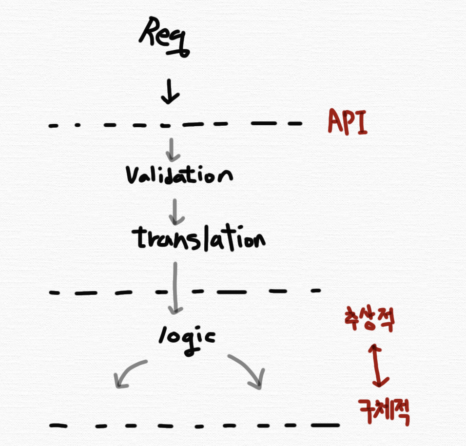

## API 설계하기

### 전체적인 API의 흐름



1. 요청(Request)
2. Validation
3. Translation
4. 비즈니스 로직

요청 이후, API(System에 의해 구현)의 시작이다.

<br>

### 요청 데이터에 대한 검증(Validation)

유효성 검사는 많은 것을 의미할 수 있지만, API에서의 유효성 검사는 주로 올바른 데이터인지에 대한 검증을 말한다. <br>

예를 들어, 다음과 같은 검증을 할 수 있습니다. <br>

- 해당 속성이 필수적인지?
- 해당 속성의 타입이 올바른가?

Spring에서 Bean Validation을 통해 유효성 검사를 진행할 수 있다. <br>

```Java

@PostMapping("/api/v1/members")
public CreateMemberRes saveMember(@RequestBody @Valid MemberDto memberDto) {
    // something...
}

```

<br>

### Translation - DTO

검증이 끝난 데이터는 보통 `translation` 단계를 거친다. 이는 내부 비즈니스 로직을 드라이브하는 데 필요한 핵심 엔티티로 변환하는 단계를 말한다. <br>

API에 맞는 별도의 객체 DTO 클래스를 통해 request를 받는다. 달리 말하면 API에 엔티티가 직접 노출되지 않게 한다. <br>
엔티티를 직접 노출하게 된다면(@RequestBody에 직접 매핑한 것을 말함), 다음과 같은 어려움이 있다. <br>

1. 엔티티가 변경되면 API 스펙 자체가 변경된다.
2. 하나의 엔티티에 각 API를 위한 모든 요구사항을 담기 힘들다.
3. API 검증을 위한 로직이 엔티티에 직접 들어간다.

<br>

DTO에 대해 더욱 상세한 내용은 아래 글들을 참고. <br>
[DTO에 대하여](https://github.com/lewns2/Toy/blob/master/articles/spring-framework/dto.md)

<br>

### 비즈니스 로직

translation된 결과는 비즈니스 로직으로 전달된다. 이는 원하는 바를 달성하기 위해 다른 컴포넌트와 인터랙션을 한다. <br>
통상 그렇게 할 때, DI(Dependency Injection)란 기법을 통해 컴포넌트의 호출을 처리하게 된다. <br>

의존성 주입에 대한 내용은 아래 글을 참고. <br>
[의존성 주입(DI)와 IoC 컨테이너](https://github.com/lewns2/Toy/blob/master/articles/spring-framework/spring_core_IoC.md)

<br>
