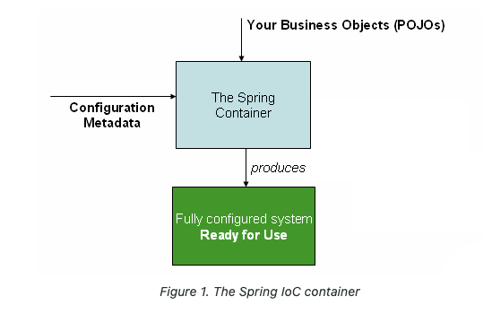

## 스프링의 핵심 기술

AppConfig처럼 객체를 생성하고 관리하면서 의존관계를 연결해주는 것을 IoC 컨테이너 또는 DI 컨테이너라 한다.

### The IoC Container

IoC는 의존성 주입(DI)이라고도 합니다. 객체가 종속성을 정의하는 프로세스입니다.

생성자, 팩터리 메서드에 대한 인수 또는 개체 인스턴스가 생성되거나 팩터리 메서드에서 반환된 후 개체 인스턴스에 설정된 속성을 통해서만 가능합니다.

컨테이너는 빈을 생성할 때 이러한 의존성을 주입합니다.

org.springframework.beans 및 org.springframework.context 패키지는 Spring Framework의 IoC 컨테이너의 기반입니다.

ApplicationContext는 BeanFactory의 하위 인터페이스입니다.

BeanFactory는 구성 프레임워크와 기본 기능을 제공하고 ApplicationContext는 더 많은 엔터프라이즈 특정 기능을 추가합니다.

스프링 컨테이너에 등록되고 관리되는 객체를 스프링 빈이라 한다.

Bean은 Spring IoC 컨테이너에 의해 인스턴스화, 관리되는 객체입니다.

org.springframework.context.ApplicationContext 인터페이스는 Spring IoC 컨테이너를 나타내며 빈 인스턴스화, 구성 및 조립을 담당합니다.

애플리케이션 클래스는 구성 메타데이터와 결합되어 ApplicationContext가 생성되고 초기화된 후 완전히 구성되고 실행 가능한 시스템 또는 애플리케이션을 갖게 됩니다.

### Spring AOP APIs
