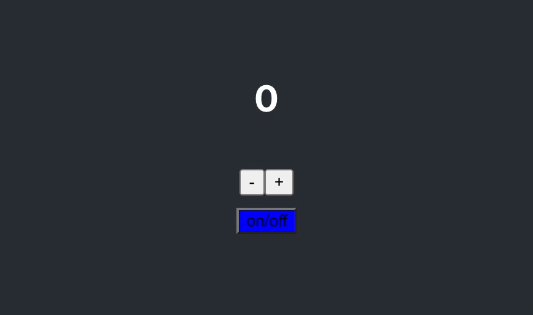

# 타이머 앱 테스트

## 1. 프로젝트 생성
```
yarn add create react-app timer-test-app
```
<br>

**yarn을 선택한 이유** <br>
npx(npm)과 yarn 중 yarn을 통해 프로젝트를 사용하는 이유는 `npm audix fix`로 해결되 지않는 취약점으로 인해 yarn을 선택했습니다. 

> (나중에 npm과 yarn 비교해보기) <br>
> [npm audit으로 보안취약점을 발견했을 때의 조치](https://lovemewithoutall.github.io/it/npm-audit-fix/) <br>
> [node_modules로부터 우리를 구원해 줄 Yarn Berry](https://toss.tech/article/node-modules-and-yarn-berry)

<br>

## 2. ESLint 설정하기
### 1. `.eslintrc.json` 파일 생성하기
### 2. testing을 위한 eslint 플러그인 설치

> ESLint Plugin 이란? <br>
> eslint에서 기본으로 제공하지 않는 다양한 규칙을 플러그인을 통해 사용

**Eslint Testing Plugins 설치**
테스트 시, render로 DOM을 그리는 역할을 하는 `testing-library`와 expect-matcher로 테스팅 부분을 위해 `jest-dom` 설치

<br>

**Install eslint-plugin-testing-library**
```
yarn add --dev eslint-plugin-testing-library
```
Git 주소 : [eslint-plugin-testing-library](https://github.com/testing-library/eslint-plugin-testing-library)

<br>

**Install eslint-plugin-jest-dom**
```
yarn add --dev eslint-plugin-jest-dom
```
Git 주소 : [jest-dom](https://github.com/testing-library/jest-dom)


### 3. 설치한 플러그인을 eslint 설정

**.eslintrc.json**
```json
{   
    /* 외부 플러그인 추가 */
    "plugins": [
        "testing-library",
        "jest-dom"
    ],

    /* 실 사용을 위한 규칙 설정 */
    "extends": [
        "react-app",
        "react-app/jest",
        "plugin:testing-library/react",
        "plugin:jest-dom/recommended"
    ]
}
```

<br>

## 테스트 코드 작성 및 기능 구현

* 테스트 코드 작성 시, 아래와 같은 절차를 따른다.

> 1. 테스트에 대한 정의 : 무엇을 테스트할 것인가?
> 2. 테스트 컴포넌트 렌더링
> 3. screen 객체를 통해 테스트하고자 하는 엘리먼트 접근
> 4. matcher를 통해 기댓값 확인

<br>

### 1. 카운터 엘리먼트 테스트

|분류|대상|설명|
|:------:|:---:|---|
|정의|counter|counter는 0부터 시작해야한다.|
|Component Render|App.js|App.js를 렌더링한다.|
|기댓값|counter|0|

<br>

**테스트 코드 작성**
```javascript
/* App.test.js */ 

test('the counter start at 0', () => {
  // 테스트 컴포넌트 렌더링
  render(<App />);

  // screen object를 이용해서 원하는 엘리먼트에 접근(접근 할 때 ID로)
  const counterElement = screen.getByTestId("counter");

  // ID가 counter인 엘리먼트의가 0인지 테스트
  expect(counterElement).toBe(0);
});
```
<br>

**테스트에 대응하는 실제 코드 작성**
```javascript
/* App.js */

import './App.css';
import { useState } from 'react';

function App() {

  const [counter, setCounter] = useState(0);

  return (
    <div className="App">
      <header className="App-header">
        <h3 data-testid="counter">{counter}</h3>
      </header>
    </div>
  );
}

export default App;
```
<br>

**테스트 확인**
```bash
Expected: 0
Received: <h3 data-testid="counter">0</h3>
```

해당 테스트 코드는 엘리먼트 자체를 들고오므로 값에 대한 기대를 확인할 수 없음.
<br>

**테스트 코드 수정**
```javascript
test('the counter start at 0', () => {
  // 테스트 컴포넌트 렌더링
  render(<App />);
  
  // screen object를 이용해서 원하는 엘리먼트에 접근(접근 할 때 ID로)
  const counterElement = screen.getByTestId("counter");

  // ID가 counter인 엘리먼트가 0인지 테스트
  expect(counterElement).toHaveTextContent(0);
});
```
<br>

### 2. 플러스, 마이너스 생성

|분류|대상|설명|
|:------:|:---:|---|
|정의|+버튼, -버튼|+, - 버튼이 올바르게 생성되었는지 확인한다.|
|Component Render|App.js|App.js를 렌더링한다.|
|기댓값|counter|버튼 내 +, - 텍스트가 올바르다.|
<br>

**테스트 코드 작성**
```javascript
test("minus button has correct text", () => {
  render(<App/>);
  const minusButtonElement = screen.getByTestId("minus-button");
  expect(minusButtonElement).toHaveTextContent("-");
});

test("plus button has correct text", () => {
  render(<App/>);
  const plusButtonElement = screen.getByTestId("plus-button");
  expect(plusButtonElement).toHaveTextContent("+");
})
```
<br>

**테스트에 대응하는 실제 코드 작성**
```javascript
<div>
    <button data-testid="minus-button">-</button>
    <button data-testid="plus-button">+</button>
</div>
```
<br>

### 3. 플러스, 마이너스 기능 추가

|분류|대상|설명|
|:------:|:---:|---|
|정의|+버튼, -버튼, counter|+버튼을 누르면 카운터가 1로 변한다(증가) / -버튼을 누르면 카운터가 -1로 변한다(감소).|
|Component Render|App.js|App.js를 렌더링한다.|
|기댓값|counter|+버튼, -버튼 클릭 시, 각각 1, -1이 된다.|
<br>

`FireEvent API` : 유저가 발생시키는 액션(이벤트)에 대한 테스트를 해야하는 경우 사용한다. <br>
[FireEvent 공식 문서](https://testing-library.com/docs/dom-testing-library/api-events/)
<br>

**테스트 코드 작성**
```javascript
test("When the + button is pressed, the counter changes to 1", () => {
  render(<App/>);
  const buttonElement = screen.getByTestId("plus-button");
  fireEvent.click(buttonElement);
  const counterElement = screen.getByTestId("counter");
  expect(counterElement).toHaveTextContent(1);
})

test("When the - button is pressed, the counter changes to -1", () => {
  render(<App/>);
  const buttonElement = screen.getByTestId("minus-button");
  fireEvent.click(buttonElement);
  const counterElement = screen.getByTestId("counter");
  expect(counterElement).toHaveTextContent(-1);
})
```
<br>

**테스트에 대응하는 실제 코드 작성**
```javascript

const [counter, setCounter] = useState(0);

<button data-testid="minus-button"
    onClick={() => setCounter((counter) => counter - 1)}
>-</button>
<button data-testid="plus-button" 
    onClick={() => setCounter((counter) => counter + 1)}
>+</button>
```
<br>

### 4. ON/OFF 버튼 만들기

|분류|대상|설명|
|:------:|:---:|---|
|정의|on/off-button|ON/OFF 버튼은 파란색으로 만들어야 한다.|
|Component Render|App.js|App.js를 렌더링한다.|
|기댓값|on/off-button|button의 backgroundColor가 파란색이다.|
<br>

**테스트 코드 작성**
```javascript
test("on/off button has blue color", () => {
  render(<App/>);
  const buttonElement = screen.getByTestId("on/off-button");
  expect(buttonElement).toHaveStyle({backgroundColor : "blue"});
})
```
<br>

**테스트에 대응하는 실제 코드 작성**
```javascript
<div>
    <button data-testid="on/off-button" style={{backgroundColor:"blue"}}>
    on/off
    </button>
</div>
```
<br>

### 5. ON/OFF 버튼 클릭 시, 버튼 비활성화

|분류|대상|설명|
|:------:|:---:|---|
|정의|on/off-button, plus-button, minus-button|on/off 버튼을 클릭 할 때, +, - 버튼을 못누르게 막기|
|Component Render|App.js|App.js를 렌더링한다.|
|기댓값|on/off-button, plus-button, minus-button|버튼의 disabled 속성이 true가 된다.|
<br>

**테스트 코드 작성**
```javascript
test("Prevent the -, + button from being pressed when the on/off button is clicked", () => {
  render(<App/>);
  const onOffButtonElement = screen.getByTestId("on/off-button");
  fireEvent.click(onOffButtonElement);
  const plusButtonElement = screen.getByTestId("plus-button");
  expect(plusButtonElement).toBeDisabled();
})
```
<br>

**테스트에 대응하는 실제 코드 작성**
```javascript
import './App.css';
import { useState } from 'react';

function App() {

  const [counter, setCounter] = useState(0);
  const [disabled, setDisabled] = useState(false);

  return (
    <div className="App">
      <header className="App-header">
        <h3 data-testid="counter">{counter}</h3>
        <div>
          <button data-testid="minus-button"
            onClick={() => setCounter((counter) => counter - 1)}
            disabled = {disabled}
          >
            -
          </button>
          <button data-testid="plus-button" 
            onClick={() => setCounter((counter) => counter + 1)}
            disabled = {disabled}
          >
            +
          </button>
        </div>
        <div>
          <button 
            data-testid="on/off-button" 
            style={{backgroundColor:"blue"}}
            onClick={() => setDisabled((prev) => !prev)}
          >
            on/off
          </button>
        </div>
      </header>
    </div>
  );
}

export default App;
```
<br>

## 완성된 모습

테스트 코드를 통해 기능 구현이 끝났으면, 실행해서 확인하기.

**프로젝트 실행**
```
yarn start
```

**타이머 동작** <br>


<br>

## 후기

실제 화면을 통해 계속 대조하며, 문제점을 찾는 것이 아니라 <br>
테스트 코드 작성을 통해 문제점을 확실히 파악하며 작성하는 것이 기능 구현의 완성을 높일 수 있음을 느꼈다. <br>
관건은 테스트 코드를 얼마나 정확하게 작성하는 지 인 것 같다. <br>

하지만, 아직 의문인 점은 어디까지 테스트를 해야하는 지이다. <br>
기능, CSS의 모든 사소한 것까지 테스트하게 된다면, 오히려 개발보다 테스트에 소요되는 시간이 많지 않을까?
