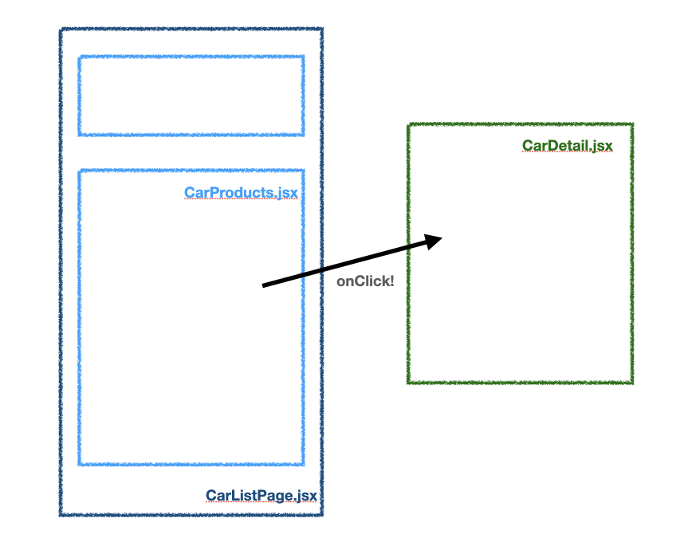
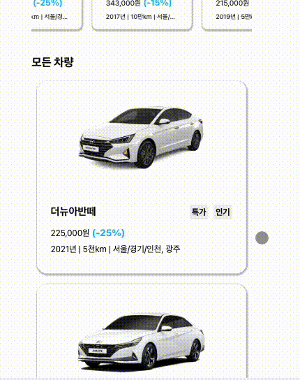

### 실행 방법

**패키지 설치**

```bash
yarn install
```

**Client 실행**

```bash
yarn start
```

**json-server 실행**

```
json-server db.json --routes routes.json --port 8080
```

<br>

### src 폴더 구조

```bash
src
├── App.css
├── App.js
├── App.test.js
├── RoutesHandler.js    // 프로젝트 라우터 설정
├── components    // 프로젝트에 공통적으로 사용되는 스타일 컴포넌트 정의
│   ├── AllVehicles.jsx
│   ├── Card.jsx
│   ├── Carousel.jsx
│   ├── Container.jsx
│   ├── Modal.jsx
│   ├── ModalContent.jsx
│   ├── MoreButton.jsx
│   ├── Top.jsx
│   ├── Top2.jsx
│   ├── Top3.jsx
│   └── Top4.jsx
├── index.css
├── index.js
├── logo.svg
├── mocks   // API 테스트를 위한 msw 데이터 및 서버 설정
│   ├── handlers.js
│   └── server.js
├── pages
│   └── CarListPage   // 페이지 컴포넌트와 이에 사용되는 함수 정의
│       ├── CarDetail
│       ├── CarDetail.jsx
│       ├── CarList
│       │   ├── Carousel
│       │   │   ├── handleCarouselInitSetting.js
│       │   │   └── handleCarouselWork.js
│       │   ├── Modal
│       │   │   └── handlePreventScroll.js
│       │   ├── MoreButton
│       │   │   └── handleOffset.js
│       │   └── loadCarList.js
│       ├── CarListPage.jsx
│       ├── CarProducts
│       │   ├── handleComponentType.js
│       │   └── makeCarouselData.js
│       ├── CarProducts.jsx
│       └── tests   // 기능에 대한 테스트 코드 정의
│           ├── CarListPage.test.js
│           ├── Modal.test.js
│           └── Products.test.js
├── reportWebVitals.js
└── setupTests.js   // API mocking 초기화 설정

```

그 외 파일

- `.prettierrc` : 코드 컨벤션 및 일관성을 위한 prettier 설정
- `.eslintrc.json` : 테스트 코드 작성 시, 컨벤션 및 일관성을 위한 eslint 설정

### 컴포넌트 구조 설계



## 기능 동작


<br><br>

## 요구 사항 및 구현

### 차량 리스트


- [x] [페이지 경로는 '/list'로 설정해주세요.](https://github.com/lewns2/react-test-with-car-list/blob/main/src/RoutesHandler.js)
- [x] [대부분의 사용자는 모바일로 사용하지만, 데스크탑에서도 사용할 수 있도록 해주세요. (페이지의 최대 너비는 420px로 설정하고, 화면의 중앙에 위치시켜주세요.)](https://github.com/lewns2/react-test-with-car-list/blob/main/src/components/Container.jsx)
- [x] 차량은 최초의 5대를 보여주고, 남은 차량이 있으면 '더보기' 버튼을 노출해주세요. (버튼 클릭 시 5대씩 리스트에 추가해주세요.) <br>
      &rarr; [남은 차량 여부에 따른 더보기 버튼 스타일, 클릭 시 offset 증가에 대한 정의](https://github.com/lewns2/react-test-with-car-list/blob/main/src/components/MoreButton.jsx) <br>
      &rarr; [더보기 버튼 표시 여부(offset과 maxpage 활용)](https://github.com/lewns2/react-test-with-car-list/blob/main/src/pages/CarListPage/CarList/MoreButton/handleOffset.js) <br>
      &rarr; [버튼 클릭 시 5대씩 화면 추가 표시(클릭 시, offset을 1씩 증가)](https://github.com/lewns2/react-test-with-car-list/blob/main/src/pages/CarListPage/CarProducts.jsx) <br>
- [x] [상품의 가격은, 3자리마다 콤마(,)로 구분해주세요.](https://github.com/lewns2/react-test-with-car-list/blob/main/src/components/Card.jsx)
- [x] [거리는 1000 이상은 천, 10000 이상은 만으로 표기해주세요. ex) 500, 5천, 5만, 20만](https://github.com/lewns2/react-test-with-car-list/blob/main/src/components/Card.jsx)

**테스트**

- **차량 리스트 페이지 타이틀 테스트** : [차량 리스트 페이지의 title 테스트](https://github.com/lewns2/react-test-with-car-list/blob/main/src/pages/CarListPage/tests/CarListPage.test.js)
- **데이터 요청/응답 테스트** : [`모든 차량`에 대한 요청 및 응답 테스트](https://github.com/lewns2/react-test-with-car-list/blob/main/src/pages/CarListPage/tests/Products.test.js)
- **더보기 버튼 기능 테스트** : [버튼 클릭 시, 화면에 차량 정보 5개가 추가가 되는 지 여부](https://github.com/lewns2/react-test-with-car-list/blob/main/src/pages/CarListPage/tests/Products.test.js) / [남은 차량이 없는 경우, 더보기 버튼 스타일 변경 여부](https://github.com/lewns2/react-test-with-car-list/blob/main/src/pages/CarListPage/tests/CarListPage.test.js)
- **가격 요구 사항 테스트** : [10의 자리 반올림, 콤마 이후의 올바른 값과 동일 여부 판단](https://github.com/lewns2/react-test-with-car-list/blob/main/src/pages/CarListPage/tests/Products.test.js)
- **거리 요구 사항 테스트** : [1000이상, 10000 이상의 경우 한글 표기가 되므로, 숫자를 파싱 후 1000 미만의 수들인지 확인](https://github.com/lewns2/react-test-with-car-list/blob/main/src/pages/CarListPage/tests/Products.test.js)
- **할인율 요구 사항 테스트** : ['-'는 고정이므로, '-0%' 꼴의 문자열의 갯수가 0인지 판단](https://github.com/lewns2/react-test-with-car-list/blob/main/src/pages/CarListPage/tests/Products.test.js)

<br>

---

<br>

### 캐러셀


- [x] 차량 리스트 상단에 캐러셀 슬라이더를 구현해주세요. <br>
      &rarr; [차량 리스트 페이지에 캐러셀 정의](https://github.com/lewns2/react-test-with-car-list/blob/main/src/pages/CarListPage/CarListPage.jsx) <br>
      &rarr; [캐러셀 스타일 컴포넌트](https://github.com/lewns2/react-test-with-car-list/blob/main/src/components/Carousel.jsx) <br>
      &rarr; [캐러셀 초기 설정, 캐러셀 로직](https://github.com/lewns2/react-test-with-car-list/tree/main/src/pages/CarListPage/CarList/Carousel) <br>
- [x] [carTypeTages: '특가'인 차량이 캐러셀 포함 대상입니다.](https://github.com/lewns2/react-test-with-car-list/blob/main/src/pages/CarListPage/CarProducts/makeCarouselData.js)
- [x] [내용은 차량 리스트의 박스 컨텐츠와 동일하지만, 하단 표기 정보인 `연식 | 주행거리 | 지역` 컨텐츠의 길이가 20자를 초과한다면 끝을 `...`로 생략해주세요.](https://github.com/lewns2/react-test-with-car-list/blob/main/src/components/Card.jsx)

### 특이 사항

**기능**

- **캐로셀 종류** : 무한 캐로셀

<br>

---

<br>

### 차량 상세



- [x] 차량 리스트에서 차량 영역 클릭하면 차량 상세 정보 모달이 열리도록 구현해주세요. <br>
      &rarr; [차량 리스트 페이지에 모달 정의](https://github.com/lewns2/react-test-with-car-list/blob/main/src/pages/CarListPage/CarListPage.jsx) <br>
      &rarr; [모달 스타일 컴포넌트](https://github.com/lewns2/react-test-with-car-list/blob/main/src/components/Modal.jsx) <br>
- [x] [모달이 열려있을 때 차량 리스트는 Dim처리해주세요.](https://github.com/lewns2/react-test-with-car-list/blob/main/src/components/Modal.jsx) ([Dim 영역은 스크롤되지 않게 해주세요.](https://github.com/lewns2/react-test-with-car-list/blob/main/src/pages/CarListPage/CarList/Modal/handlePreventScroll.js))
- [x] [Dim 영역이나 x 버튼을 클릭하면 모달이 닫히도록 해주세요.](https://github.com/lewns2/react-test-with-car-list/blob/main/src/components/Modal.jsx)
- [x] [모달 내 컨텐츠가 넘칠 경우, 모달 내에서 스크롤이 되도록 구현해주세요.](https://github.com/lewns2/react-test-with-car-list/blob/main/src/components/Modal.jsx)

**테스트**

- **[모달 통합 테스트](https://github.com/lewns2/react-test-with-car-list/blob/main/src/pages/CarListPage/tests/Modal.test.js)** : 모달에 관한 시나리오를 수립하여 통합 테스트 진행 <br>
  → 1. 차량 리스트의 차량 영역 클릭 시, 모달 창이 열린다. <br>
  → 2. 모달 창에 Loading... 이 표시되고, 이후 차량 상세 정보를 불러온다. <br>
  → 3. X 버튼 클릭 시, 모달 창이 닫힌다. <br>
  → 4. 데이터를 불러오다 error 발생 시 Error... 문구가 표시된다. <br>

<br>

### 테스트 방안

- [jest와 msw 모킹을 통한 API 테스트](https://github.com/lewns2/Toy/blob/master/articles/msw.md)
