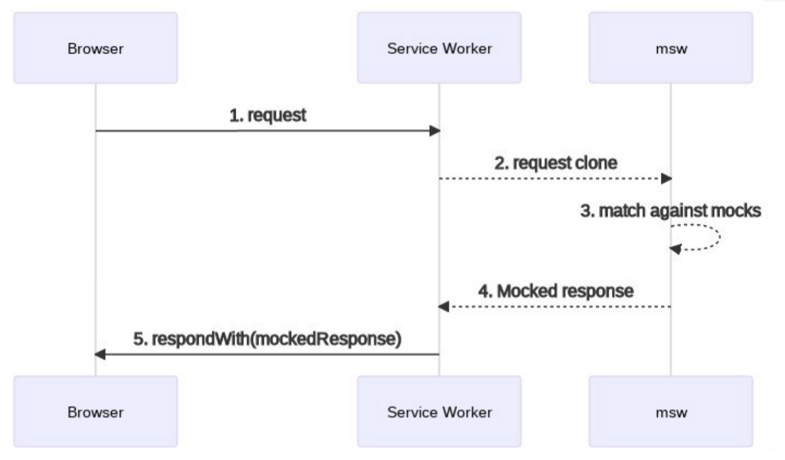

## Jest와 MSW에 대하여

### MSW(Mock Service Worker)란?

MSW는 Mock Service Worker로 서비스 워커를 이용하여 API를 모킹하는 라이브러리입니다. <br>

> mocking(모킹) : 테스트하고자 하는 코드가 의존하는 함수나 클래스에 대해 가짜 객체를 만드는 기법

즉, 서비스 워커 API를 활용하여 네트워크 요청을 가로채 MSW에 전달하여 handler에 정의된 모의 응답을 받습니다.


### 도입하기

**1. msw 설치**

```
yarn add msw --dev
```

<br>

**2. 핸들러 정의**

1.  src/mocks/handlers.js 생성
2.  REST API, GraphQL API 두가지 유형의 API를 mocking 할 수 있습니다. 여기선 rest api를 mocking하기 위해 rest를 import합니다.
3.  api 요청 시도를 위해 함수를 정의하는 데, 이때 방식, 경로, 함수를 작성합니다.

```javascript
import { rest } from 'msw';

export const handlers = [
    rest.get('http://localhost:8080/carClasses', (req, res, ctx) => {
        return res (
            ctx.json([
                // json data
            ])
        )
    }
```

> handler argument
>
> - req : 요청에 관한 정보
> - res : 가짜 응답
> - ctx : 가짜 응답의 정보 집합

<br>

**3. 모킹 서버 생성** <br>

1.  src/mocks/server.js 생성
2.  앞서 작성한 핸들러를 가지고 노드 환경을 만듭니다.

```javascript
import { setupServer } from 'msw/node';
import { handlers } from './handlers';

/* mocking server 셍성 */
export const server = setupServer(...handlers);
```

<br>

**4. API 모킹 설정** <br>
각 테스트별로 모킹에 의한 사이드 이펙트를 없애기 위해 모킹 핸들러를 초기화시키기 위한 설정을 해줍니다. <br>
테스트 환경에 관한 설정을 하므로 src/setupTests.js에 작성합니다.

```javascript
import '@testing-library/jest-dom';

/* API mocking 설정 */
import { server } from './mocks/server';

beforeAll(() => server.listen());

afterEach(() => server.resetHandlers());

afterAll(() => server.close());
```

<br>

### 테스트 코드 작성하기

쿼리에 대한 정보 : [Testing Library](https://testing-library.com/docs/) <br>
테스트 코드 작성 : [테스트 관련 레포지토리](https://github.com/lewns2/learn-about-testing-for-react)

### 느낀점

올바른 테스트 코드를 작성하는 것은 쉽지 않았습니다. <br>
무엇을 테스트할 지, 어떻게 참을 증명할 지, 해당 쿼리가 올바르게 동작하는 지 일일이 체크를 해야하기 때문입니다. <br>
실제로 코드를 작성하며 아래와 같은 상황으로 애를 먹은 적이 있습니다. <br>
<br>
예를 들어 원소의 갯수가 0인 경우, '참'인 경우가 있습니다.<br>
이때, 갯수를 올바르게 센 것이 아니라 잘못된 코드로 인해 아무것도 걸리지 않은 경우가 발생하여 테스트가 통과하는 상황이 발생하였습니다.<br>
이를 통해 테스트 코드 작성 시, 의도적으로 테스트가 통과하지 못하는 코드를 작성한 뒤, 이후 올바른 코드를 작성하는 것이 좋다고 생각했습니다.<br>

### Reference

- 콴다 팀블로그 - [MSW로 API 모킹하기](https://blog.mathpresso.com/msw%EB%A1%9C-api-%EB%AA%A8%ED%82%B9%ED%95%98%EA%B8%B0-2d8a803c3d5c)
- kakao FE 기술블로그 - [MSW 모킹 코드 재사용하기 feat. Storybook, Jest](https://fe-developers.kakaoent.com/2022/220317-integrate-msw-storybook-jest/)
